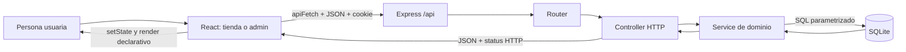
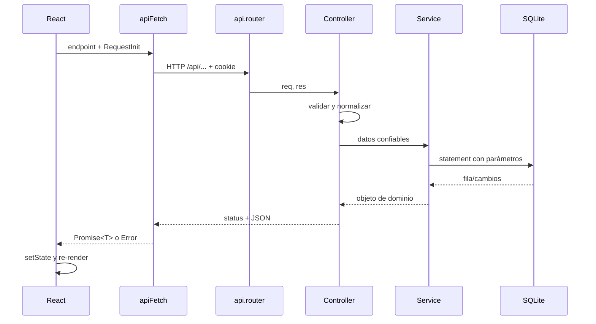
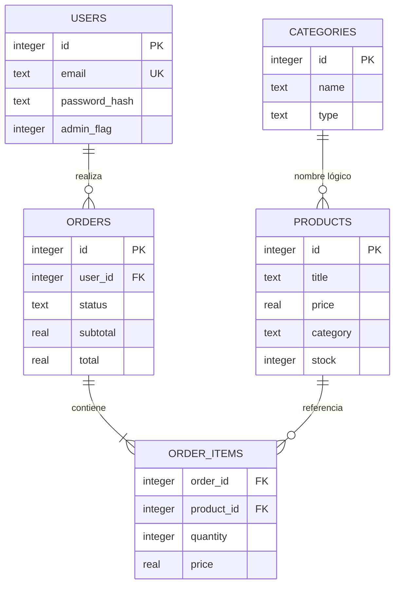
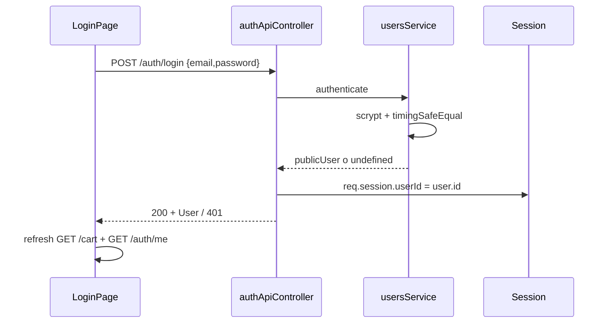
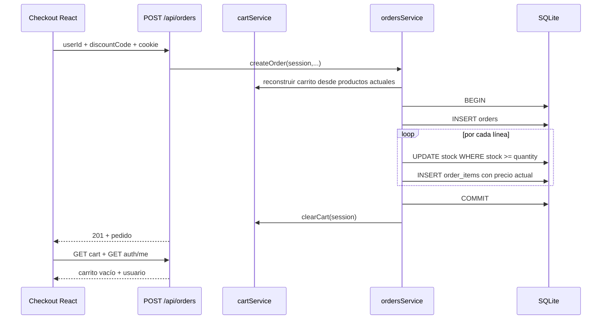
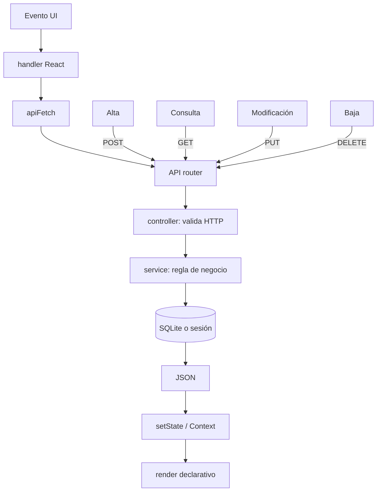

# Pediloo: guía integral del código, la lógica y los flujos

> Documento de estudio generado desde el código vigente de `reactfinal` y `Web-1`.
> Fecha de revisión: 5 de agosto de 2026.
> Criterio: cuando el README y el código difieren, este documento describe primero lo que el código realmente hace.

## 1. Qué sistema estamos estudiando

Pediloo no es un único programa. Son dos aplicaciones conectadas:

- `reactfinal`: Single Page Application hecha con React 19, TypeScript y Vite. Contiene la tienda pública y el dashboard administrativo.
- `Web-1`: servidor Express 5. Expone una API REST, mantiene sesión y carrito, aplica reglas de negocio y persiste en SQLite. También conserva una tienda EJS anterior, hoy secundaria frente a React.

La idea central es cliente-servidor: React nunca abre `database.db`. React envía HTTP; Express decide si la operación es válida; los servicios ejecutan SQL; SQLite conserva el resultado.

> **Respaldo del diagrama:** `reactfinal/src/utils/api.ts:33-59` → `Web-1/app.js:66-72` → `Web-1/routes/api.router.js:16-51` → `Web-1/controllers/api/productsApiController.js:73-108` → `Web-1/services/productsService.js:22-64` → `Web-1/db/database.js:12-20`.



### Fuente de verdad de cada dato

| Dato | Dónde vive | Consecuencia |
|---|---|---|
| Productos, categorías, usuarios y pedidos | SQLite | Admin y tienda leen el mismo dato; no hay que “copiar” cambios entre ambas interfaces. |
| Usuario autenticado | `req.session.userId` en Express | El navegador sólo conserva una cookie de sesión `httpOnly`. |
| Carrito | `req.session.cart` en Express | Es por sesión y guarda sólo identificador y cantidad. |
| Precio y stock de una línea de carrito | SQLite, releídos al pedir el carrito | La sesión no puede congelar ni inventar precios. |
| Descuento elegido | `localStorage` del navegador | Sobrevive a recargas en ese navegador; el backend vuelve a validar el único código aceptado. |
| Tema visual y perfil administrativo decorativo | `localStorage` | Son preferencias locales, no datos de negocio compartidos. |
| Estado React actual | memoria del componente/Context | Se pierde al recargar y se reconstruye consultando la API. |

### Índice rápido para exponer workflows

Esta tabla permite abrir el recorrido completo sin buscarlo dentro del documento. Se lee de izquierda a derecha.

| Workflow | React: origen | Router/controller | Service/persistencia |
|---|---|---|---|
| Inicializar carrito y usuario | `reactfinal/src/App.tsx:134-153` | `Web-1/routes/api.router.js:30,46`; `Web-1/controllers/api/cartApiController.js:3-7`; `Web-1/controllers/api/authApiController.js:3-6` | sesión + `Web-1/services/cartService.js:3-40` |
| Listar productos | `reactfinal/src/pages/Products/ProductsList/ProductsList.tsx:102-127` | `Web-1/routes/api.router.js:16`; `Web-1/controllers/api/productsApiController.js:73-80` | `Web-1/services/productsService.js:22-24` |
| Crear producto | `reactfinal/src/pages/Products/ProductView/ProductView.tsx:159-192` | `Web-1/routes/api.router.js:18`; `Web-1/controllers/api/productsApiController.js:88-95` | `Web-1/services/productsService.js:26-40`; `Web-1/db/schema.sql:8-17` |
| Editar producto | `reactfinal/src/pages/Products/ProductView/ProductView.tsx:159-192` | `Web-1/routes/api.router.js:19`; `Web-1/controllers/api/productsApiController.js:98-108` | `Web-1/services/productsService.js:43-59` |
| Eliminar producto | `reactfinal/src/pages/Products/ProductsList/ProductsList.tsx:129-150` | `Web-1/routes/api.router.js:20`; `Web-1/controllers/api/productsApiController.js:111-117` | `Web-1/services/productsService.js:62-64` |
| Crear/editar categoría | `reactfinal/src/pages/Categories/CategoryView/CategoryView.tsx:78-119` | `Web-1/routes/api.router.js:24-25`; `Web-1/controllers/api/categoriesApiController.js:53-79` | `Web-1/services/catalogService.js:27-53`; `Web-1/db/schema.sql:1-6` |
| Gestionar usuarios | `reactfinal/src/pages/Users/UserView/UserView.tsx:49-112` | `Web-1/routes/api.router.js:40-44`; `Web-1/controllers/api/usersApiController.js:3-28` | `Web-1/services/usersService.js:42-124`; `Web-1/db/schema.sql:19-28` |
| Login | `reactfinal/src/App.tsx:1412-1440` | `Web-1/routes/api.router.js:47`; `Web-1/controllers/api/authApiController.js:8-12` | `Web-1/services/usersService.js:35-40,126-129`; sesión |
| Agregar al carrito | `reactfinal/src/App.tsx:732-749` | `Web-1/routes/api.router.js:31`; `Web-1/controllers/api/cartApiController.js:9-14` | `Web-1/services/cartService.js:57-86`; sesión |
| Confirmar compra y bajar stock | `reactfinal/src/App.tsx:1302-1323` | `Web-1/routes/api.router.js:37`; `Web-1/controllers/api/ordersApiController.js:7-10` | `Web-1/services/ordersService.js:40-90`; `Web-1/db/schema.sql:30-51` |
| Cambiar estado de pedido | `reactfinal/src/pages/Orders/OrdersKanban/OrdersKanban.tsx:44-58` | `Web-1/routes/api.router.js:38`; `Web-1/controllers/api/ordersApiController.js:12-15` | `Web-1/services/ordersService.js:4,93-99` |
| Responsive admin | `reactfinal/src/App.tsx:1860-1885` | No interviene la API | `reactfinal/src/components/organisms/Sidebar/Sidebar.css:117-145`; `reactfinal/src/components/organisms/Header/Header.css:82-119` |

## 2. Arranque completo

### Frontend

`index.html` aporta `<div id="root">`. `src/main.tsx` monta `<App />` y activa `StrictMode`:

> **Fuente exacta:** `reactfinal/src/main.tsx:7-11`.

```tsx
createRoot(document.getElementById('root')!).render(
  <StrictMode>
    <App />
  </StrictMode>,
)
```

Se eligió el root concurrente de React porque es la API vigente de React 19. No se usa `ReactDOM.render`, que pertenece a la API anterior. `StrictMode` ayuda en desarrollo a encontrar efectos con limpieza incorrecta; por eso un efecto puede observarse dos veces en desarrollo sin que suceda igual en producción.

`App.tsx` compone providers y router:

> **Fuente exacta:** `reactfinal/src/App.tsx:1915-1929`.

```tsx
<DialogProvider>
  <SnackbarProvider>
    <StoreProvider>
      <BrowserRouter>...</BrowserRouter>
    </StoreProvider>
  </SnackbarProvider>
</DialogProvider>
```

Los providers son Context de React. Se eligieron porque sólo hay tres estados transversales pequeños: diálogo, snackbar y `{ cart, user, refresh }`. Redux/Zustand agregarían otra dependencia y más conceptos sin resolver una necesidad que Context ya cubre.

### Backend

`Web-1/app.js` construye Express, registra estáticos, parsers, sesión, CORS y rutas. `db/database.js` abre SQLite y ejecuta esquema/bootstrap al cargarse.

> **Fuente exacta:** `Web-1/db/database.js:12-20`. El montaje de la API está en `Web-1/app.js:66-72`.

```js
const db = new Database(dbPath);
db.exec(fs.readFileSync(schemaPath, 'utf8'));
ensureSchema(db);
ensureSeedData(db);
```

Se eligió `better-sqlite3` porque su API síncrona y las transacciones encajan bien con una aplicación académica pequeña. No se usa ORM: las consultas son cortas y visibles, y un ORM no aportaría aquí suficiente valor para compensar otra capa. Para producción distribuida, SQLite local sí deja de ser la elección correcta.

## 3. Cómo viaja cualquier petición

El adaptador central está en `src/utils/api.ts`:

> **Fuente exacta:** `reactfinal/src/utils/api.ts:33-59`. La conversión recursiva de `src` está en `reactfinal/src/utils/api.ts:17-30`.

```ts
export async function apiFetch<T>(endpoint: string, options: RequestInit = {}): Promise<T> {
  const headers = new Headers(options.headers);
  if (typeof options.body === 'string' && !headers.has('Content-Type')) {
    headers.set('Content-Type', 'application/json');
  }

  const response = await fetch(`${API_BASE_URL}${endpoint}`, {
    ...options,
    headers,
    credentials: 'include',
  });
  const text = await response.text();
  const data = text ? JSON.parse(text) as unknown : null;
  if (!response.ok) throw new Error(/* mensaje de la API */);
  return resolveAssetUrl(data) as T;
}
```

Por qué está hecho así:

- Centraliza URL, JSON, cookie y errores una sola vez; las pantallas sólo expresan endpoint y método.
- Usa `fetch`, que ya existe en el navegador. Axios no es necesario.
- `credentials: 'include'` permite enviar/recibir la cookie aunque frontend y API tengan orígenes distintos.
- Primero lee texto y sólo parsea si existe; así un `204 No Content`, como logout, no rompe con `JSON.parse('')`.
- El genérico `<T>` documenta el tipo esperado en TypeScript, pero no valida el JSON en tiempo de ejecución.
- `resolveAssetUrl` recorre objetos/arreglos y antepone el origen de la API a todo campo `src` que comience con `/`, porque los assets del catálogo son servidos por Express.

Del otro lado, `routes/api.router.js` traduce método + URL a una función controller:

> **Fuente exacta:** `Web-1/routes/api.router.js:16-20`.

```js
router.post('/products', productsApiController.create);
router.put('/products/:id', productsApiController.update);
router.delete('/products/:id', productsApiController.remove);
```

El router no contiene SQL. El controller entiende HTTP y validación. El service entiende datos y reglas. Esta separación evita duplicar validación y permite reutilizar servicios desde la tienda EJS.

> **Respaldo del workflow:** cliente `reactfinal/src/utils/api.ts:33-59`; router `Web-1/routes/api.router.js:16-51`; controller de ejemplo `Web-1/controllers/api/productsApiController.js:73-108`; service `Web-1/services/productsService.js:22-64`; conexión `Web-1/db/database.js:12-20`.



## 4. Contrato REST vigente

| Método | Endpoint | Responsable | Efecto |
|---|---|---|---|
| GET | `/api/products` | `productsApiController.getAll` | Lista; acepta `q` o `sort=asc/desc`. |
| GET | `/api/products/:id` | `getById` | Detalle o 400/404. |
| POST | `/api/products` | `create` | Valida e inserta; 201. |
| PUT | `/api/products/:id` | `update` | Reemplaza el conjunto completo de campos editables. |
| DELETE | `/api/products/:id` | `remove` | Borra y responde JSON. |
| GET/POST | `/api/categories` | categories controller | Lista/alta. |
| GET/PUT/DELETE | `/api/categories/:id` | categories controller | Detalle/edición/baja. |
| GET | `/api/cart` | cart controller | Reconstruye carrito con precio vigente. |
| POST | `/api/cart/items` | cart controller | Agrega `{ productId }`. |
| PUT | `/api/cart/items/:productId` | cart controller | Aplica `{ delta }`. |
| DELETE | `/api/cart/items/:productId` | cart controller | Quita línea. |
| DELETE | `/api/cart` | cart controller | Vacía carrito. |
| GET/POST | `/api/orders` | orders controller | Lista/crea pedido. |
| PUT | `/api/orders/:id` | orders controller | Cambia estado. |
| GET/POST | `/api/users` | users controller | Lista/crea. |
| GET/PUT/DELETE | `/api/users/:id` | users controller | Detalle/edición/baja. |
| GET | `/api/auth/me` | auth controller | Usuario de la sesión o `null`. |
| POST | `/api/auth/login` | auth controller | Autentica y guarda `session.userId`. |
| POST | `/api/auth/register` | auth controller | Crea usuario común e inicia sesión. |
| DELETE | `/api/auth/session` | auth controller | Destruye sesión; 204. |
| GET | `/api/stats` | stats controller | Totales agregados. |

No existe `POST /api/upload` en Express. El frontend intercepta exactamente esa combinación dentro de `apiFetch`, usa `FileReader` y devuelve un Data URL sin efectuar HTTP. La imagen queda guardada dentro del campo `src` del producto cuando luego se hace POST/PUT. Funciona para demo, pero no equivale a subir un archivo al servidor.

## 5. Modelo de datos y objetos

### Modelo relacional

> **Fuente exacta del diagrama:** `Web-1/db/schema.sql:1-51`. Las relaciones se observan especialmente en `orders.user_id` (`30-40`) y `order_items.order_id/product_id` (`43-51`).



La relación categoría-producto no usa `category_id`: `products.category` guarda el nombre. Es simple de mostrar, pero obliga a renombrar todos los productos cuando cambia una categoría y no ofrece integridad referencial real. Una FK sería preferible si el catálogo creciera o hubiera escrituras concurrentes.

### Objetos en TypeScript

`src/utils/store.ts` define interfaces como `Product`, `CartDetail`, `User` y `Order`. Son contratos estructurales de compilación:

> **Fuente exacta:** `reactfinal/src/utils/store.ts:4-14`. Los demás DTO están en `src/utils/store.ts:16-75`.

```ts
export interface Product {
  id: number;
  title: string;
  price: number;
  category: string;
  stock: number;
  status: ProductStatus;
  // ...
}
```

No se crean instancias con `new Product()`: una interface desaparece al compilar. Los datos viajan como objetos literales/DTO JSON. Por eso este proyecto no es programación orientada a objetos clásica; no hay clases, herencia, métodos de instancia ni encapsulamiento de estado dentro de objetos.

Sí se usan objetos para:

- agrupar datos relacionados;
- enviar payloads JSON;
- mapear filas SQL a nombres adecuados para React;
- actualizar estado de forma inmutable con `{ ...objeto, campo: valor }`.

## 6. ABM de productos, de punta a punta

ABM significa Alta, Baja y Modificación. En REST se completa con lectura: POST, DELETE, PUT y GET.

### 6.1 Lectura/listado

`ProductsList.tsx` monta, ejecuta `GET /products`, normaliza etiquetas y guarda el array:

> **Fuente exacta:** `reactfinal/src/pages/Products/ProductsList/ProductsList.tsx:102-127`.

```tsx
useEffect(() => {
  async function fetchProducts() {
    const data = await apiFetch<Product[]>('/products');
    setProducts(data.map(p => ({ ...p, status: normalizeStatus(p.status) })));
  }
  fetchProducts();
}, []);
```

`useEffect` se usa porque la petición es un efecto externo al render. No se hace fetch directamente en el cuerpo del componente: cada `setState` causaría otro render y otra petición. El `[]` significa “al montar”.

Búsqueda y filtro son funcionales y locales:

> **Fuente exacta:** `reactfinal/src/pages/Products/ProductsList/ProductsList.tsx:152-164`.

```tsx
const filteredProducts = products.filter(product => {
  if (filterType === 'low-stock' && product.stock > 12) return false;
  const term = searchTerm.toLowerCase();
  return product.title.toLowerCase().includes(term)
    || product.category.toLowerCase().includes(term)
    || product.id.toString().includes(term);
});
```

Se eligió `filter` porque crea un nuevo array sin mutar el original. Para el volumen actual evita otra petición por cada tecla. Con miles de productos debería migrar a búsqueda/paginación del backend.

### 6.2 Alta

Flujo real:

1. `/admin/products/new` monta `ProductView` sin `id`; `isEditMode` es falso.
2. Los inputs controlados mantienen `title`, `price`, `stock`, `src`, `description`, `category` en `useState`.
3. Las categorías se obtienen de `/categories`; no se admite una categoría libre inexistente.
4. `handleSave` limita precio y stock a valores no negativos y forma un objeto.
5. `apiFetch` envía `POST /api/products`.
6. `productsApiController.create` vuelve a validar el límite de confianza.
7. `normalizeProductBody` busca la categoría y adopta su escritura canónica.
8. `productsService.createProduct` ejecuta INSERT parametrizado.
9. La respuesta 201 contiene el producto con `id`, stock y status derivados.
10. React navega al listado; la próxima lectura muestra el registro persistido.

Payload del frontend:

> **Fuente exacta:** `reactfinal/src/pages/Products/ProductView/ProductView.tsx:159-192`. El objeto se construye en `173-180` y se envía en `183-190`.

```tsx
const productPayload = {
  title,
  price: Math.max(0, Number(price) || 0),
  stock: Math.max(0, Math.floor(Number(stock)) || 0),
  src,
  description,
  category: category.trim(),
};
await apiFetch('/products', {
  method: 'POST',
  body: JSON.stringify(productPayload),
});
```

Validación del controller:

> **Fuente exacta:** `Web-1/controllers/api/productsApiController.js:4-38`; precio en `13-15` y stock en `33-35`.

```js
if (typeof body.price !== 'number' || !Number.isFinite(body.price) || body.price < 0) {
  return 'El campo price debe ser un número mayor o igual a cero';
}
if (body.stock !== undefined && (!Number.isInteger(body.stock) || body.stock < 0)) {
  return 'El campo stock debe ser un entero mayor o igual a cero';
}
```

La validación se repite intencionalmente. La del navegador mejora UX; la del servidor protege el dato. Nunca se confía en que todas las peticiones vendrán desde nuestro formulario.

SQL:

> **Fuente exacta:** `Web-1/services/productsService.js:26-40`.

```js
db.prepare(`
  INSERT INTO products (title, description, price, src, category, isTopSeller, stock)
  VALUES (?, ?, ?, ?, ?, ?, ?)
`).run(/* valores */);
```

Los `?` separan estructura SQL y valores. No se usa interpolación porque concatenar entrada del cliente permitiría inyección SQL y errores de escape.

### 6.3 Modificación

Con `/admin/products/:id`, dos efectos cargan categorías y producto. Se guarda además `originalData` para revertir la edición sin volver a pedirla.

El guardado reutiliza el mismo formulario y cambia sólo endpoint/método:

> **Fuente exacta:** `reactfinal/src/pages/Products/ProductView/ProductView.tsx:183-190`.

```ts
const endpoint = isEditMode ? `/products/${id}` : '/products';
const method = isEditMode ? 'PUT' : 'POST';
```

Se eligió un componente compartido para alta/edición porque campos y validación son prácticamente idénticos. Separarlos duplicaría el formulario. Se usa PUT con payload completo; PATCH sería mejor sólo si se necesitaran ediciones parciales o clientes con versiones diferentes del recurso.

El status no se guarda en la tabla:

> **Fuente exacta:** `Web-1/services/productsService.js:5-20`. La tabla confirma que no existe columna `status` en `Web-1/db/schema.sql:8-17`.

```js
function statusFromStock(stock) {
  if (stock === 0) return 'Sin Stock';
  if (stock <= 12) return 'Stock Bajo';
  return 'Activo';
}
```

Derivarlo evita estados imposibles como `stock: 0` junto a `status: 'Activo'`. No se eligió una columna duplicada porque duplicar una consecuencia obliga a mantenerla sincronizada en cada escritura.

### 6.4 Baja

La UI pide confirmación con `DialogProvider`, luego hace DELETE. La baja real es física:

> **Fuente exacta:** service `Web-1/services/productsService.js:62-64`; controller HTTP `Web-1/controllers/api/productsApiController.js:111-117`; llamada React `reactfinal/src/pages/Products/ProductsList/ProductsList.tsx:129-150`.

```js
function deleteProduct(productId) {
  return db.prepare('DELETE FROM products WHERE id = ?').run(productId).changes > 0;
}
```

No se implementó soft delete (`deleted_at`) porque no hay requisito de restauración/auditoría. Debería agregarse antes de necesitar historial inmutable o recuperación.

Advertencia verificada: en `ProductsList.tsx`, el `catch` de la baja también elimina el producto del estado local. Si la API falla, la fila desaparece sólo hasta recargar. Eso no es sincronización real y debe explicarse como defecto, no como feature.

## 7. ABM de categorías

### Alta/lectura/baja

- `CategoriesList.tsx`: GET y grilla.
- `CategoryView.tsx` sin `id`: POST `{ name, icon }`; el backend asigna `type: 'other'` si falta.
- El controller rechaza nombres duplicados con 409.
- DELETE se bloquea con 409 si todavía hay productos asociados.

### Renombrar una categoría

Esta operación necesita consistencia entre dos tablas. `catalogService.updateCategory` usa una transacción:

> **Fuente exacta:** `Web-1/services/catalogService.js:37-53`. La llamada desde React está en `reactfinal/src/pages/Categories/CategoryView/CategoryView.tsx:78-119`.

```js
const update = db.transaction(() => {
  db.prepare('UPDATE categories SET name = ?, icon = ?, type = ? WHERE id = ?')
    .run(categoryData.name, categoryData.icon, categoryData.type, categoryId);

  if (current.name !== categoryData.name) {
    db.prepare('UPDATE products SET category = ? WHERE category = ?')
      .run(categoryData.name, current.name);
  }
});
update();
```

Se eligió transacción porque categoría y productos deben cambiar juntos o no cambiar. Dos UPDATE independientes podrían dejar productos con el nombre anterior si el segundo falla.

Después, `CategoryView.tsx` hace varios PUT de productos para reflejar checks asignados/desasignados. Usa `Set` para consultar pertenencia en tiempo constante y `Promise.all` para enviar cambios en paralelo. Esta parte es N+1 y no es transaccional con el rename: una API de asignación masiva sería necesaria si se exige atomicidad completa o hay muchos productos.

## 8. ABM de usuarios y autenticación

### Usuario como dato público/privado

`usersService.publicUser` actúa como mapper y nunca devuelve `password_hash`:

> **Fuente exacta:** `Web-1/services/usersService.js:4-14`; sus usos de lectura están en `16-24`.

```js
function publicUser(row) {
  return row && {
    id: row.id,
    name: row.name,
    email: row.email,
    adminFlag: Boolean(row.admin_flag),
    // sin password_hash
  };
}
```

Separar la forma pública evita filtrar hashes por accidente. Las contraseñas se almacenan con `scrypt`, salt aleatorio y comparación temporalmente segura:

> **Fuente exacta:** `Web-1/services/usersService.js:30-40`.

```js
const salt = crypto.randomBytes(16).toString('hex');
const hash = crypto.scryptSync(password, salt, 64).toString('hex');
crypto.timingSafeEqual(actual, Buffer.from(expected, 'hex'));
```

Se usa el módulo estándar `node:crypto`; no hace falta una dependencia para obtener una KDF adecuada. Nunca se guarda texto plano ni se usa un hash rápido como SHA-256 para contraseñas.

### Alta y modificación

`UserView.tsx` reutiliza un formulario controlado. En alta exige contraseña; en edición la omite para conservar el hash actual. El backend valida nombre, apellido, email único, longitud y confirmación.

### Último administrador

Al degradar o borrar un admin, el service cuenta administradores y rechaza con 409 si quedaría cero. La regla está en el backend porque debe proteger todos los clientes, no sólo el botón del dashboard.

### Login

> **Respaldo del diagrama:** formulario y request `reactfinal/src/App.tsx:1412-1440`; endpoint `Web-1/routes/api.router.js:46-49`; controller `Web-1/controllers/api/authApiController.js:8-12`; verificación `Web-1/services/usersService.js:35-40,126-129`; refresh global `reactfinal/src/App.tsx:134-153`.



`StoreProvider.refresh` ejecuta carrito y usuario con `Promise.all` porque son independientes. Ahorrar una espera secuencial mejora el tiempo de arranque sin complicar la lógica.

## 9. Carrito: qué se guarda y qué se recalcula

La sesión sólo guarda:

> **Fuente exacta:** `Web-1/services/cartService.js:3-9,57-83`. El objeto literal se crea en `cartService.js:82`; no es una tabla SQLite.

```js
[{ productId: '1', quantity: 2 }]
```

Al consultar el carrito, `buildCartItem` busca cada producto en SQLite y calcula precio/subtotal:

> **Fuente exacta:** `Web-1/services/cartService.js:11-40`.

```js
const product = productsService.getProductById(cartLine.productId);
const unitPrice = product.price;
return { productId, quantity, unitPrice, subtotal: unitPrice * quantity, /* ... */ };
```

Se eligió guardar sólo ID/cantidad porque título, imagen, precio y categoría pueden cambiar. Si se confiaran valores enviados por el navegador, el cliente podría modificar el precio. La contrapartida es una consulta por línea; para carritos grandes convendría un único SELECT con `IN (...)`.

Agregar:

1. React hace POST `/cart/items` con `productId`.
2. El service verifica existencia y `stock > 0`.
3. Si ya existe, incrementa sólo si `quantity < stock`; si no, crea cantidad 1.
4. React llama `refresh`, recibe el carrito reconstruido y actualiza badge/listado.

Modificar cantidad usa un delta entero. Si la nueva cantidad queda en cero, `splice` elimina la línea. El stock aún no se descuenta: agregar al carrito reserva intención, no inventario.

## 10. Compra y descuento de stock

El flujo empieza en `CheckoutPage.handleSubmit`:

> **Fuente exacta:** `reactfinal/src/App.tsx:1302-1323`; payload en `1310-1316`.

```tsx
const createdOrder = await apiFetch<Order>('/orders', {
  method: 'POST',
  body: JSON.stringify({
    userId: user?.id || null,
    discountCode: discount?.code,
  }),
});
```

Los campos de nombre, email, dirección y notas del formulario sólo usan validación HTML visual: no tienen `name`, no se leen y no se envían a la API. Por lo tanto hoy no se persisten datos de entrega.

La lógica crítica está en `ordersService.createOrder`:

> **Fuente exacta:** `Web-1/services/ordersService.js:40-90`; transacción en `55-88`.

```js
const create = db.transaction(() => {
  const result = insertOrder.run(/* total y descuento */);
  for (const item of detail.items) {
    const stockResult = reduceStock.run(item.quantity, item.productId, item.quantity);
    if (stockResult.changes !== 1) {
      throw Object.assign(new Error(`Stock insuficiente para ${item.title}`), { statusCode: 409 });
    }
    insertItem.run(result.lastInsertRowid, item.productId, item.quantity, item.unitPrice);
  }
  return result.lastInsertRowid;
});
```

El UPDATE es atómico y defensivo:

> **Fuente exacta:** `Web-1/services/ordersService.js:73-82`.

```sql
UPDATE products
SET stock = stock - ?
WHERE id = ? AND stock >= ?
```

No se hace “leer stock, restar en JavaScript, guardar” porque dos compras concurrentes podrían leer el mismo stock y vender de más. La condición `stock >= cantidad` y `changes === 1` convierten la base en el árbitro final.

Toda la creación está dentro de una transacción. Si falla una línea, SQLite revierte cabecera, líneas anteriores y descuentos de stock ya hechos. Sólo después del commit se vacía el carrito. Esta es la razón principal para no repartir esta lógica entre React y varios endpoints.

El descuento se calcula nuevamente en el backend. Actualmente sólo `DESCUENTO10` produce 10%; cualquier otro código equivale a cero. No se confía en un porcentaje enviado por el cliente.

> **Respaldo del workflow de compra:** React `reactfinal/src/App.tsx:1302-1323` → router `Web-1/routes/api.router.js:36-38` → controller `Web-1/controllers/api/ordersApiController.js:7-10` → transacción `Web-1/services/ordersService.js:40-90` → tablas `Web-1/db/schema.sql:30-51`.



## 11. Estado del pedido entre tienda, admin y API

Estados permitidos: `Recibido`, `En proceso`, `Listo para entregar`.

1. Una compra nace siempre como `Recibido` en SQLite.
2. `OrdersKanban.tsx` pide `/orders`, `/products` y `/users` en paralelo.
3. Agrupa visualmente con `orders.filter(order => order.status === status)`.
4. Drag-and-drop o `<select>` llama PUT `/orders/:id` con `{ status }`.
5. La UI aplica actualización optimista: cambia el array antes de esperar.
6. El backend rechaza cualquier valor fuera de `STATUSES`.
7. Si falla, React restaura `currentOrder`.
8. La cuenta del cliente vuelve a ver el estado persistido al cargar su historial.

> **Fuente exacta del cambio optimista:** `reactfinal/src/pages/Orders/OrdersKanban/OrdersKanban.tsx:44-58`. Validación/persistencia: `Web-1/services/ordersService.js:4,93-99`. Historial de cuenta: `reactfinal/src/App.tsx:1623-1644`.

```tsx
setOrders(current => current.map(order =>
  order.id === orderId ? { ...order, status } : order
));
try {
  await apiFetch(`/orders/${orderId}`, { method: 'PUT', body: JSON.stringify({ status }) });
} catch {
  setOrders(current => current.map(order => order.id === orderId ? currentOrder : order));
}
```

Se eligió actualización optimista porque el movimiento se siente inmediato y hay rollback simple. No se implementan WebSockets: la tienda/admin no reciben cambios en vivo; se sincronizan al volver a consultar o recargar. Agregar polling/SSE/WebSocket sólo sería necesario con requisito de tiempo real.

## 12. Programación funcional, objetos e imperativo

### Funcional/declarativo, paradigma dominante

- Componentes React como funciones: props/estado entran, JSX sale.
- `map`, `filter`, `reduce` y `sort` derivan vistas/estadísticas.
- Actualización inmutable: `setOrders(current => current.map(...))`.
- Funciones puras: `statusFromStock`, `dateKey`, `getDateRange`, `calculateFinances`, `validateRegisterForm`, `optimizedImage`.
- Composición: atoms → molecules → organisms → pages.

Ejemplo de reducción:

> **Fuente exacta:** `reactfinal/src/pages/Finances/Finances.tsx:57-103`; la línea destacada es `61`.

```ts
const revenue = validOrders.reduce((sum, order) => sum + order.total, 0);
```

Se usa `reduce` cuando muchos elementos producen un total. Un `for` también sería válido; en `ordersService` sí se prefiere `for...of` porque las operaciones SQL secuenciales y la posibilidad de lanzar un error son más claras que un reduce con efectos.

### Objetos, pero no orientación a objetos clásica

Se trabaja con objetos planos, interfaces y módulos. El encapsulamiento se da a nivel de archivo (`usersService`, `cartService`) y closures/hooks, no mediante clases. Llamarlo “programación basada en objetos y modular” es más exacto que decir que el sistema está orientado a objetos.

### Imperativo donde la plataforma lo exige

- `useEffect` coordina fetch, listeners y limpieza.
- `FinanceChart` crea/destruye un chart externo y un tooltip DOM.
- `Cubes`, `DotCursor`, `ClickSpark`, `BorderGlow` e `ImageZoomModal` trabajan con refs, canvas, GSAP, `requestAnimationFrame` y eventos.
- Los services ejecutan SQL en orden explícito.

Son islas imperativas encerradas detrás de componentes/funciones para que el resto conserve un modelo declarativo.

## 13. Responsive: lógica real

La respuesta a tamaños es mayormente CSS, no JavaScript. Es la elección correcta: media queries pertenecen al motor de layout, evitan listeners de `resize` y funcionan antes de que React ejecute.

| Breakpoint | Archivos | Cambio principal |
|---|---|---|
| `<=1150px` | `Finances.css` | Reordena el donut/leyenda. |
| `<=1100px` | `OrdersKanban.css` | Kanban de tres columnas pasa a una. |
| `<=1024px` | `App.css`, `Sidebar.css`, `Header.css`, `Home.css`, `ProductView.css`, `Profile.css` | Navegación tienda móvil; sidebar admin se vuelve drawer; layouts se apilan. |
| `<=960px` | `Finances.css` | Header y gráficos se reorganizan. |
| `<=900px` | `CategoryView.css` | Formulario y asignación de productos pasan a una columna. |
| `<=768px` | estilos MD3 y páginas | Oculta columnas secundarias; formularios en columna; botones adaptados. |
| `<=720px` | `UsersList.css` | Buscador/acciones ocupan el ancho disponible. |
| `<=600px` | `App.css`, `Header.css`, `Finances.css`, zoom modal | Grillas de una columna, acciones compactas y controles móviles. |

El drawer sí necesita estado React:

> **Fuente exacta:** estado/composición `reactfinal/src/App.tsx:1860-1885`; clase responsive del drawer `reactfinal/src/components/organisms/Sidebar/Sidebar.css:117-145`; hamburguesa `reactfinal/src/components/organisms/Header/Header.css:82-119`.

```tsx
const [isSidebarOpen, setIsSidebarOpen] = useState(false);
<Sidebar isSidebarOpen={isSidebarOpen} closeSidebar={closeSidebar} />
```

CSS decide si la sidebar es fija o flotante; React sólo decide abierta/cerrada. En la tienda, `StaggeredMenu` anima el panel con GSAP y restaura foco/scroll. `prefers-reduced-motion` desactiva o reduce animaciones para accesibilidad. `DotCursor` además detecta touch/pantalla pequeña porque un cursor personalizado no tiene sentido allí.

Imágenes responsive:

> **Fuente exacta:** uso real de `<picture>` `reactfinal/src/App.tsx:643-647` y `701-705`; construcción de variante AVIF `reactfinal/src/utils/images.ts:1-5`. El bloque siguiente simplifica el nombre de la variable, pero conserva la misma lógica.

```tsx
<picture>
  <source media="(max-width: 700px)" srcSet={optimizedImage(image, 640)} />
  
</picture>
```

`optimizedImage` cambia assets locales PNG/JPG por variantes AVIF preexistentes. No procesa archivos en runtime; sólo construye el nombre. Se eligió AVIF por peso y `<picture>`/dimensiones explícitas para reducir transferencia y saltos de layout.

## 14. Finanzas como ejemplo de lógica funcional

`calculateFinances(orders, products)` es una transformación casi pura:

- crea `Map` de producto por ID para evitar `find` repetido;
- excluye estado `cancelado` si apareciera;
- reduce facturación;
- distribuye descuento proporcionalmente con `order.total / order.subtotal`;
- acumula ventas por producto, categoría y día;
- deriva ticket promedio, margen estimado y rankings.

`ESTIMATED_COST_RATE = 0.65` no proviene de costos reales: la ganancia es una estimación fija de 35%. Se dejó como constante porque no hay modelo de costos. Debe reemplazarse por costo por producto si la métrica se vuelve contable.

Los filtros de fecha usan `<input type="date">`, una capacidad nativa, no una librería de calendario. `useMemo` evita recalcular agregaciones cuando no cambian órdenes, productos o rango.

## 15. Atomic Design y composición

- Atoms: `Button`, `Card`, `Chip`, `Icon`, `IconButton`, progress, theme toggle. No conocen productos ni pedidos.
- Molecules: diálogo, snackbar y zoom; combinan comportamiento y atoms.
- Organisms: Header/Sidebar y estructuras grandes.
- Pages: coordinan API, estado de dominio, navegación y feedback.

El backend EJS conserva la misma taxonomía en `views/partials/atoms`, `molecules`, `organisms`, `templates` y `pages`. Atomic Design organiza UI, no reemplaza las capas de datos ni es un paradigma de negocio.

## 15 bis. Respaldo teórico completo y contraste con Pediloo

Esta sección cruza los módulos T1-T7, `ReactRecargado.pdf`, `css intermedio.pdf` y los requisitos/mockups del Sprint 5 con el código vigente. La regla para defender el proyecto es separar siempre tres niveles:

1. **qué dice el concepto**;
2. **cómo se implementó en Pediloo**;
3. **qué alternativa de los apuntes no se eligió y por qué eso no constituye un error**.

No todo ejemplo de la teoría debe aparecer en un mismo proyecto. La teoría ofrece herramientas; la arquitectura selecciona las que resuelven el problema concreto.

### Mapa teoría → código → respuesta defendible

| Bloque teórico | Concepto | Evidencia concreta en Pediloo | Respuesta corta para una defensa |
|---|---|---|---|
| T1 | React, JSX, DOM virtual y SPA | `src/main.tsx` monta `<App />` en un único `root`; `App.tsx` decide la vista con React Router. | “React mantiene una descripción declarativa de la UI y reconcilia los cambios; no reemplazamos manualmente nodos del DOM para cada dato.” |
| T1 | Herramientas y build | `package.json` usa React 19, TypeScript y Vite; `vite.config.ts` activa el plugin React. | “Vite sirve y empaqueta; React resuelve la interfaz. Son responsabilidades distintas.” |
| T2 | Componentes, props y composición | `Button.tsx`, `Card.tsx`, `Chip.tsx`, `Dialog.tsx`, layouts y páginas. | “Las props configuran al componente y `children` permite componer contenido sin herencia.” |
| T2 | Listas y `key` | `ProductsList.tsx` transforma productos con `map` y usa `product.id`. | “La key representa identidad estable para que React reconcilie correctamente altas, bajas y reordenamientos.” |
| T2 | Atomic Design | `components/atoms`, `molecules`, `organisms` y `pages`; `Layout`/`AdminLayout` cumplen el papel estructural de template. | “Atomic Design ordena la UI por nivel de composición; no reemplaza servicios, API ni base de datos.” |
| T3 | Estado y eventos | Formularios controlados, filtros, diálogos, sidebar, carrito y callbacks `onClick`/`onChange`. | “El evento solicita un cambio; el setter modifica estado y React vuelve a calcular la UI.” |
| T4 | CSS, cascada y responsive | CSS importado por componente, variables en `index.css`, Flexbox/Grid, media queries, estados y animaciones. | “El proyecto usa CSS nativo global co-localizado, con tokens y nombres específicos para reducir colisiones.” |
| T5 | Hooks y efectos | `useState`, `useEffect`, `useContext`, `useRef`, `useMemo`, `useCallback`, `useSyncExternalStore` y hooks propios. | “Los hooks agregan estado, sincronización y reutilización de lógica a componentes funcionales.” |
| T6 | Fetch y REST | `src/utils/api.ts` centraliza `fetch`; Express expone `/api`; controller, service y SQLite completan el flujo. | “La UI nunca accede a SQLite: intercambia HTTP/JSON y el backend vuelve a validar.” |
| T7 | Routing | `BrowserRouter`, `Routes`, `Route`, `Link`, `NavLink`, `Navigate`, `useParams`, `useNavigate`, `useLocation` y `useSearchParams`. | “La URL es estado de navegación; React Router relaciona esa URL con la página sin recargar el documento.” |
| Sprint 5 | Dashboard responsive fiel a mockups | Header, Sidebar, Main Area, páginas de productos, modo mobile y estilos adaptativos. | “El mockup definió estructura y estados visuales; el código los convirtió en componentes y breakpoints reutilizables.” |

### Cobertura exacta de la carpeta de teoría

La revisión no se limitó a los títulos principales. Se contrastaron las 33 fuentes textuales/teóricas (31 Markdown y 2 PDF) y las 15 referencias visuales disponibles:

| Fuente revisada | Contenido incorporado en esta guía |
|---|---|
| T1: `React.md`, `PrimerosPasos.md`, `PreparandoNuestraApp.md`, `NuestroPrimerProyecto.md`, `EstructuraDeUnProyecto.md` | React, JSX, montaje, DOM/reconciliación, SPA, estructura Vite, scripts y build. |
| T2: `AtomicDesign.md`, `Componentes.md`, `ComoListarComponentes.md`, `ComponentesDentroDeComponentes.md`, `ComponentesPuros.md`, `Props.md`, `QueEsUnComponente.md`, `Templates.md`, `TrabajandoConUnComponente.md` | Descomposición, props, `children`, pureza, listas/keys, templates y Atomic Design. |
| T3: `Estados.md`, `Interactividad.md`, `RespondiendoEventos.md` | Estado como snapshot, setters, inmutabilidad, eventos, formularios y render derivado. |
| T4: `CascadingStyleSheets.md`, `Estilos.md`, `Sass.md` | Cascada, estrategia de estilos, responsive y contraste CSS nativo/Modules/Sass. |
| T5: `Contexto.md`, `CustomHooks.md`, `EfectosColaterales.md`, `FuncionesReductoras.md`, `Hooks.md`, `UseRef.md` | Reglas de hooks, efectos/cleanup, Context, hooks propios, reducer, ref, memo y callbacks. |
| T6: `Peticiones.md` | `fetch`, promesas, async/await, estados de petición, REST y manejo de errores. |
| T7: `Routing.md` | Router, enlaces, rutas dinámicas, layouts, 404 y comparación de las dos APIs de React Router. |
| `ReactRecargado.pdf` (36 páginas) | Elementos, clases versus funciones, ciclo de vida, condicionales, listas, formularios, elevación de estado, composición y hooks. |
| `css intermedio.pdf` (62 páginas) | Selectores, especificidad, unidades, tipografía, box model, fondos, variables, posición, overflow, Flexbox, Grid y animaciones. |
| `sprint_5_analisis_completo.md`, `Sprint-5/requirements.md`, `Sprint-5/requirements_analysis.md` | Alcance, criterios, jerarquía visual, estados y adaptación responsive del dashboard. |
| 15 PNG de `Sprint-5/assets` | Contraste visual de escritorio/mobile, sidebar, header, listado y detalle/edición de producto. |

### T1. React, JSX, renderizado y herramientas

#### React es una librería, no todo el sistema

React se ocupa de describir y actualizar la interfaz. Pediloo agrega otras piezas porque React por sí solo no ofrece routing, servidor, persistencia ni base de datos:

- React renderiza componentes;
- React Router relaciona URL y página;
- `apiFetch` comunica el navegador con Express;
- Express aplica HTTP, sesión y reglas de negocio;
- SQLite persiste los datos;
- Vite sirve el entorno de desarrollo y genera el bundle de producción.

Por eso es correcto llamar a React “librería de UI”. La aplicación completa sí forma una arquitectura mayor.

#### Punto de entrada y JSX

`src/main.tsx:1-11` usa `createRoot` para montar un árbol React en el nodo `#root` de `index.html`. JSX no llega como HTML directo al navegador: TypeScript/Vite lo transforman en llamadas que producen elementos React. Un elemento es una descripción inmutable de lo que se quiere mostrar; un componente es la función reutilizable que produce esa descripción.

`<StrictMode>` agrega comprobaciones de desarrollo. En modo desarrollo puede repetir montajes o efectos para revelar efectos impuros. No significa que producción vaya a ejecutar cada petición dos veces. La respuesta correcta ante una duplicación aparente es comprobar primero Strict Mode y, luego, que el efecto tenga dependencias y limpieza correctas.

#### DOM real, reconciliación y render

Cuando cambia estado o props, React vuelve a ejecutar la función del componente, compara el nuevo árbol de elementos con el anterior y aplica al DOM real sólo las mutaciones necesarias. “Renderizar de nuevo” no equivale a “recrear toda la página”.

Ejemplo real: al escribir en la búsqueda de `ProductsList.tsx`, cambia `searchQuery`; React recalcula `filteredProducts`; luego actualiza las filas visibles. El código no llama a `document.createElement` ni borra la tabla manualmente.

#### SPA no significa “un único archivo cargado de golpe”

Pediloo es una SPA porque el navegador mantiene el mismo documento y la navegación principal ocurre del lado cliente. A la vez, `App.tsx:55-66` usa `lazy` y `Suspense`, por lo que páginas administrativas pueden descargarse en fragmentos separados. Son ideas compatibles:

- **SPA:** navegación sin pedir un documento HTML nuevo para cada pantalla;
- **code splitting:** el JavaScript de todas las pantallas no tiene que descargarse inicialmente.

El hosting necesita redirigir rutas desconocidas a `index.html`; luego React Router interpreta `/admin/productos/7`. Sin ese fallback, una recarga directa puede dar 404 aunque la navegación interna funcione.

### T2. Componentes, props, composición, pureza y listas

#### Un componente debe tener una responsabilidad comprensible

La división real va desde atoms visuales hasta páginas que coordinan datos:

- `Card` resuelve superficie, variante y composición;
- `Button` resuelve apariencia, accesibilidad nativa y ripple;
- `Dialog` resuelve una interacción modal;
- `ProductsList` consulta, filtra y coordina acciones de productos;
- `ProductView` coordina el formulario de creación/edición;
- `AdminLayout` arma la navegación común del dashboard.

Dividir no consiste en crear un archivo por cada etiqueta. Un componente nuevo se justifica cuando encapsula una responsabilidad, se reutiliza o hace más legible una unidad compleja.

#### Props, `children` y flujo unidireccional

`Card.tsx:15-44` recibe `variant`, `interactive`, `padding`, `className`, `children` y atributos nativos restantes. El padre decide la configuración y el hijo la consume. El hijo no debe mutar props: si necesita solicitar un cambio, llama un callback recibido o modifica su propio estado.

`children` es composición. En Pediloo permite que un `Card`, un provider o un layout envuelva contenido sin conocerlo de antemano. Es la aplicación práctica de “composición sobre herencia”: no existen subclases de `Card` para cada pantalla.

#### Componentes puros

Un render puro devuelve la misma descripción para las mismas entradas y no modifica el mundo externo durante la ejecución. Las peticiones, temporizadores, escritura de almacenamiento y foco pertenecen a eventos o efectos, no al cuerpo de render.

Pureza no significa que toda la aplicación sea estática. Significa separar:

- cálculo derivado y JSX durante render;
- interacción del usuario en handlers;
- sincronización con sistemas externos en efectos;
- persistencia y reglas del dominio en backend.

Helpers como `formatPrice`, `calculateDiscount` o los filtros de productos son fáciles de razonar porque transforman entradas en salidas sin mutar datos externos.

#### Listas y claves

`ProductsList.tsx` usa `map` para convertir objetos en filas y `product.id` como `key`. La key no se muestra ni llega automáticamente como prop: es una pista interna de identidad para React.

Regla de defensa:

- usar ID estable del dato cuando existe;
- evitar `Math.random()`, porque cambia en cada render;
- evitar el índice cuando una lista puede insertar, eliminar o reordenar;
- el índice es tolerable en contenido verdaderamente estático, como una secuencia fija que no cambia de orden.

El listado de productos necesita IDs porque admite borrado y filtrado. En cambio, una lista fija de acciones de un diálogo no sufre el mismo riesgo, aunque un ID explícito seguiría siendo más robusto si esas acciones pasaran a ser dinámicas.

#### Atomic Design aplicado, no dogmático

La teoría define atoms, molecules, organisms, templates y pages. En React, Pediloo materializa atoms/molecules/organisms/pages en carpetas, mientras `Layout` y `AdminLayout` actúan como templates aunque no estén dentro de una carpeta llamada `templates`.

La clasificación depende de responsabilidad, no de tamaño de archivo. Un atom puede tener lógica visual, como el ripple de `Button`, y seguir siendo atom porque no conoce el dominio. Una página puede componer atoms directamente sin violar Atomic Design si no existe una abstracción intermedia útil.

### T3. Estado, eventos, formularios y elevación de estado

#### Estado no es una variable común

Una variable local desaparece entre renders y modificarla no avisa a React. `useState` conserva el valor asociado a la posición del hook y su setter agenda un nuevo render.

Cada render ve una **instantánea** del estado. Por eso, si el próximo valor depende del anterior, Pediloo usa la forma funcional:

```tsx
setUsers((current) => current.filter((user) => user.id !== id))
```

La función recibe la versión vigente y evita depender de una captura vieja. `UsersList.tsx:69` usa justamente este patrón después de un borrado. No se debe mutar un objeto o array y volver a guardar la misma referencia; se crea una nueva estructura.

#### Los eventos se pasan, no se ejecutan durante render

Correcto: `onClick={handleSave}`. Incorrecto: `onClick={handleSave()}` si se pretende esperar al click. La segunda forma ejecuta la función mientras React renderiza y asigna su resultado como handler.

Los handlers de `ProductView.tsx` muestran la separación:

- `onChange` actualiza estado controlado;
- `handleSave` valida y hace `POST` o `PUT`;
- `handleCancel` restaura datos o navega;
- `handleImageChange` procesa el archivo elegido y actualiza la vista previa.

`preventDefault` se usa cuando se quiere conservar el comportamiento semántico de un `<form>` pero evitar la navegación/recarga nativa para controlar el envío desde React.

#### Formularios controlados

Un input controlado tiene `value` proveniente de estado y `onChange` que actualiza ese estado. En `ProductView.tsx:25-43` se declaran los campos; en el JSX, inputs, select y textarea leen esos valores. El estado React es la fuente de verdad de la edición.

Esto permite que la vista previa y el formulario muestren simultáneamente el mismo título, precio, imagen y descripción. Es una forma de **elevar/centralizar estado** en el ancestro común: dos regiones hermanas no mantienen copias que puedan divergir.

Se combinan tres capas de validación:

1. atributos HTML como `required`, `min` y `type="number"` mejoran experiencia y accesibilidad;
2. el handler evita enviar valores evidentemente inválidos y da feedback inmediato;
3. el controller de Express valida de nuevo porque el cliente no es una frontera de seguridad.

### T4. CSS intermedio y estrategia real de estilos

#### Qué estrategia usa el proyecto

Pediloo importa archivos `.css` junto a cada componente, pero eso **no los convierte en CSS Modules**. Selectores como `.product-view` siguen siendo globales. La co-localización mejora organización; el aislamiento se logra por convención de nombres, no por transformación automática.

Tampoco se usa Sass: no hay `.scss`/`.sass`, mixins ni compilador Sass. Las variables `--nombre` son custom properties nativas de CSS y existen en tiempo de ejecución; no son variables `$nombre` de Sass.

Respuesta defendible: “Conocemos CSS Modules y Sass por la teoría, pero el proyecto eligió CSS nativo porque alcanza para esta escala y evita otra dependencia. Si aparecieran colisiones frecuentes o una necesidad fuerte de mixins, reevaluaríamos esa decisión.”

#### Conceptos del PDF presentes en el código

- **Cascada y especificidad:** orden de reglas, clases, atributos de tema y algunos `!important` resuelven prioridades. `!important` debe ser excepcional porque dificulta sobrescrituras.
- **Modelo de caja:** `box-sizing: border-box` hace que padding y borde queden dentro del ancho calculado.
- **Variables:** `:root` concentra colores, elevaciones y otras decisiones; `[data-theme="dark"]` reemplaza tokens sin duplicar todos los componentes.
- **Flexbox:** organiza ejes de barras, acciones y grupos lineales.
- **Grid:** distribuye áreas y tarjetas bidimensionales.
- **Posicionamiento:** `relative` crea referencia para hijos `absolute`; `sticky` fija cabeceras dentro del scroll; overlays y controles usan capas y `z-index`.
- **Pseudoclases:** `:hover`, `:focus`, `:active` y estados similares expresan interacción sin estado React adicional.
- **Pseudoelementos:** `::before`/`::after` agregan decoración que no merece markup semántico.
- **Media queries:** los breakpoints reorganizan sidebar, tablas, formularios y acciones según el espacio disponible.
- **Animación:** `@keyframes`, `transition` y `transform` aportan continuidad; `prefers-reduced-motion` respeta a quien solicita menos movimiento.
- **Overflow:** evita que tablas, paneles o contenido largo rompan el layout.

No todo estado visual necesita JavaScript. Hover, foco, layout adaptable y movimiento puramente presentacional son responsabilidad natural de CSS. React se reserva para estados que afectan datos, estructura o lógica.

### T5. Hooks, contexto, referencias y efectos

#### Reglas de hooks

Los hooks se llaman:

1. en el nivel superior de un componente o custom hook;
2. en el mismo orden en cada render;
3. nunca dentro de condiciones, bucles o handlers.

React asocia el estado por orden de llamada. Alterar ese orden impediría saber qué valor corresponde a cada hook.

#### Inventario razonado

| Hook | Uso real | Por qué corresponde |
|---|---|---|
| `useState` | formularios, búsqueda, sidebar, diálogos, carga/error | Guarda estado local que cambia la UI. |
| `useEffect` | carga de API, escucha de teclado, foco y sincronizaciones | Conecta React con sistemas externos después del render. |
| `useContext` | carrito/usuario, diálogo y snackbar | Comparte capacidades transversales sin pasar props por cada nivel. |
| `useRef` | elemento del diálogo y referencias imperativas | Conserva identidad mutable sin provocar render; permite foco/control DOM puntual. |
| `useMemo` | cálculos agregados o derivados costosos | Memoriza un resultado, no un efecto. Es optimización, no requisito de corrección. |
| `useCallback` | callbacks estables como `refresh`, confirmaciones o handlers reutilizados | Memoriza identidad de una función cuando una dependencia/effecto o hijo la necesita. |
| `useSyncExternalStore` | tema conectado a `localStorage`/`matchMedia` | Suscribe React correctamente a un estado externo. |
| hooks propios | `useRipple`, `useTheme`, `useDialog`, `useSnackbar`, `useAppState`, `useStoredDiscount` | Encapsulan lógica reutilizable; no crean un almacén compartido por sí mismos. |

`useReducer` aparece en la teoría pero no en el código. No es obligatorio: sirve cuando muchas transiciones relacionadas se expresan mejor como `state + action → newState`. Pediloo mantiene estados locales relativamente independientes y deja el dominio persistente al backend. Se justificaría migrar una zona si sus setters empezaran a formar transiciones complejas, no para cumplir una lista de hooks.

#### Efectos: sincronización, dependencias y limpieza

`StoreProvider` define `refresh` con `useCallback` y un efecto depende de esa función para traer carrito y sesión. `ProductView` carga categorías y, si está editando, el producto indicado por `id`. `Dialog` registra teclado y devuelve una limpieza que quita el listener.

Lectura correcta de dependencias:

- sin array: después de cada render;
- `[]`: al montar en producción, con la comprobación adicional posible de Strict Mode en desarrollo;
- `[id]`: cuando cambia `id` además del montaje;
- cleanup: antes de repetir el efecto y al desmontar.

Un efecto no es la versión moderna automática de cada método de ciclo de vida. Su pregunta central es: “¿qué sistema externo debo sincronizar con este render?”. Un valor que se puede calcular de props/estado durante render normalmente no necesita efecto.

#### Context no reemplaza necesariamente un gestor de estado

Context transporta un valor hacia descendientes. En Pediloo, los providers combinan Context con `useState` y callbacks; el estado lo aporta el hook, Context evita prop drilling.

No todo debe ir a Context. La búsqueda de una tabla o el campo título de un formulario pertenecen al componente que los usa. Subirlos a un provider global aumentaría acoplamiento y renders sin beneficio.

#### `useRef` no sustituye a `useState` ni a `useMemo`

- usar estado si el cambio debe reflejarse en pantalla;
- usar ref para una referencia DOM o valor mutable cuya modificación no debe renderizar;
- usar memo para cachear un cálculo derivado cuando su costo lo justifica.

En `Dialog`, la ref permite foco y acceso imperativo al nodo. Guardar ese nodo en estado provocaría renders innecesarios.

### T6. Peticiones, REST y frontera cliente-servidor

#### Recorrido completo de una petición

```text
evento o efecto React
→ apiFetch("/products/...", opciones)
→ fetch(VITE_API_URL + "/api" + endpoint, credentials: "include")
→ router Express
→ controller: parámetros, body y respuesta HTTP
→ service: regla de negocio y SQL parametrizado
→ SQLite
→ JSON + status
→ apiFetch comprueba response.ok
→ setState / navegación / feedback
→ nuevo render
```

`src/utils/api.ts:33-59` centraliza URL base, credenciales, headers, parseo JSON, normalización de assets y errores. Esta única función evita repetir comportamiento en cada página.

`fetch` sólo rechaza automáticamente ante fallos de red o aborto, no por todo `404`/`500`. Por eso `apiFetch` revisa `response.ok` y convierte una respuesta HTTP fallida en una excepción consumible por la UI.

#### Verbos y semántica

| Verbo | Uso en Pediloo | Idea |
|---|---|---|
| `GET` | listar/obtener productos, categorías, sesión, carrito, pedidos | leer sin pedir una mutación del recurso; debe ser seguro. |
| `POST` | crear producto, login, agregar al carrito, crear pedido | crear o ejecutar una acción no idempotente. |
| `PUT` | editar producto/categoría o actualizar una cantidad según el endpoint | reemplazar/actualizar de forma idempotente con el mismo payload. |
| `DELETE` | borrar producto/categoría/usuario o quitar carrito | eliminar el recurso indicado. |

La ruta expresa recurso; el método expresa intención. El controller no debe contener SQL y el service no debe decidir cómo renderiza React una notificación.

#### REST y sesión: la precisión importante

Los endpoints reciben en cada petición la información necesaria para operar sobre el recurso, pero Pediloo **sí usa estado de sesión en servidor** para autenticación y carrito. Por eso no conviene afirmar “todo el sistema es completamente stateless”. La formulación exacta es:

> “La API sigue un diseño REST para recursos y verbos HTTP, mientras autenticación y carrito son deliberadamente stateful mediante sesión. `credentials: include` envía la cookie que identifica esa sesión.”

La cookie de sesión no contiene el precio ni autoriza por sí sola una operación; Express recupera el estado y los servicios vuelven a consultar/validar datos.

#### Validar dos veces no es duplicación inútil

La validación del navegador mejora UX, pero cualquiera puede llamar la API sin React. El controller es la frontera de confianza y debe validar tipos, rangos, existencia y permisos; la base puede reforzar invariantes con constraints y transacciones.

El checkout va más allá: `ordersService.js` usa una transacción y una actualización atómica de stock. Evita que un error intermedio deje pedido creado con stock parcialmente descontado y reduce la carrera entre “comprobar” y “actualizar”.

### T7. Routing y diferencia respecto del ejemplo de los apuntes

#### Dos APIs válidas de React Router

Los apuntes muestran la API de data router:

```tsx
createBrowserRouter(...) → <RouterProvider router={router} /> → <Outlet />
```

Pediloo usa la API declarativa:

```tsx
<BrowserRouter> → <Routes> → <Route />
```

Ambas son formas válidas de relacionar URL y elementos React. El proyecto no usa `createBrowserRouter`, `RouterProvider` ni `Outlet`. Los layouts compartidos renderizan su estructura y contienen sus propias rutas anidadas; `AdminLayout` define las rutas relativas del panel en `App.tsx:1888-1904`.

Esto también corrige una afirmación histórica del README: si allí se menciona `Outlet`, debe tratarse como intención o documentación desactualizada, porque la fuente de verdad vigente es el código.

#### Herramientas de navegación usadas

- `Link`: navega sin recarga completa;
- `NavLink`: además permite derivar estilos según ruta activa;
- `useNavigate`: navegación imperativa después de guardar, cancelar o completar una acción;
- `useParams`: obtiene IDs dinámicos como el producto editado;
- `useSearchParams`: lee/escribe filtros representados en la query string;
- `useLocation`: conoce la URL actual;
- `Navigate`: redirección declarativa;
- `*`: ruta comodín para 404 de la SPA.

La navegación declarativa (`Link`, `Navigate`) es preferible cuando la salida depende directamente del JSX. La imperativa (`navigate(...)`) corresponde cuando una secuencia termina, por ejemplo después de un guardado exitoso.

El código no implementa un guard de autorización para `/admin`; ocultar enlaces tampoco sería seguridad. Si el dashboard debiera ser privado, se requiere protección de ruta para UX y autorización real en cada endpoint sensible del backend.

### Aportes específicos de `ReactRecargado.pdf`

El PDF amplía los módulos y permite relacionar conceptos clásicos con la implementación funcional moderna:

| Tema del PDF | Aplicación o contraste |
|---|---|
| Componentes de clase y ciclo de vida | Pediloo no usa clases. `useState`/`useEffect` cubren necesidades equivalentes sin traducir mecánicamente cada método. |
| Renderizado condicional y `null` | Carga/error/vacío, diálogos cerrados y secciones opcionales usan ternarios, `&&` o retorno `null`. |
| Formularios, textarea y select | `ProductView` los controla con estado React. |
| Elevación de estado | El estado de `ProductView` alimenta formulario y preview; providers elevan carrito/usuario o feedback a un ancestro común. |
| Composición | `children` en Card, layouts y providers; no hay herencia de componentes. |
| `useEffect` y cleanup | Cargas remotas, listeners y foco; el cleanup evita listeners huérfanos. |
| `useContext` | Capacidades transversales con hooks consumidores que fallan claramente fuera del provider. |
| `useReducer` | Conocido pero no necesario actualmente. |
| `useCallback`/`useMemo` | Identidad estable de callbacks y cache de cálculos; se usan con un motivo concreto, no por defecto. |

### Aportes específicos de `css intermedio.pdf`

El PDF permite explicar decisiones visuales más allá de “se aplicaron estilos”:

- el selector determina alcance; la especificidad y el orden resuelven conflictos;
- `rem` escala con la raíz y favorece consistencia; píxeles siguen siendo útiles para detalles fijos;
- modelo de caja, padding, border y margin explican dimensiones reales;
- Flexbox resuelve una dimensión y Grid dos dimensiones;
- `position` cambia el flujo y el bloque de referencia;
- `z-index` sólo tiene sentido dentro de contextos de apilamiento;
- media queries responden al espacio disponible, no al nombre de un dispositivo;
- animación debe comunicar estado o continuidad y respetar movimiento reducido;
- variables CSS facilitan tema y coherencia sin preprocesador.

El proyecto no necesita demostrar cada selector o unidad del PDF. La defensa debe relacionar la herramienta con el problema resuelto, no recitar un catálogo.

### Requisitos y mockups del Sprint 5 frente al resultado

La teoría visual del sprint define una jerarquía clara: Sidebar + Main Area, header, contenido, pantallas de listado/detalle y adaptación mobile. El código traduce esa referencia a componentes y comportamiento real:

| Requisito visual/funcional | Implementación |
|---|---|
| Navegación lateral persistente en escritorio | `AdminLayout` + Sidebar y estado visual de ruta. |
| Menú móvil | Estado local abre/cierra navegación; media queries cambian composición. |
| Header, búsqueda y acciones | Componentes de cabecera y controles reutilizables. |
| Lista de productos | `ProductsList`: carga, búsqueda, filtros, estado vacío, navegación y borrado. |
| Alta/edición/detalle | `ProductView`: modo según parámetro/ruta, formulario controlado y preview. |
| Estados de feedback | Snackbar, diálogo, progreso, error/vacío. |
| Responsive | Breakpoints reorganizan columnas, acciones, formularios y tablas. |

Un mockup no prescribe necesariamente arquitectura interna. Define apariencia, jerarquía, contenido y estados; componentes, API y modelo de datos son decisiones de implementación que deben sostener ese resultado.

### Ajustes finos: afirmaciones teóricas que conviene responder con precisión

| Afirmación simplificada | Versión precisa para defender |
|---|---|
| “Cada cambio de props obliga siempre al hijo a pintar el DOM.” | El padre puede volver a renderizar al hijo, pero reconciliación y memoización determinan las mutaciones reales; render React no equivale a escritura DOM. |
| “`setState` cambia el valor inmediatamente.” | Agenda una actualización; el handler actual conserva la instantánea de su render. Usar updater funcional si depende del valor previo. |
| “`useEffect(..., [])` corre exactamente una vez.” | En producción corresponde al montaje; Strict Mode de desarrollo puede ejecutar un ciclo extra para detectar efectos impuros. |
| “Toda lógica va en `useEffect`.” | Sólo sincronización externa. Cálculos derivados pueden hacerse durante render; acciones del usuario pertenecen a handlers. |
| “Una dependencia actualizada dentro del efecto siempre crea loop.” | Crea loop si la actualización vuelve a cambiar sin condición una dependencia. Puede ser válida si converge o está protegida, aunque suele señalar diseño revisable. |
| “Context es una variable global.” | Es un canal jerárquico cuyo valor lo entrega el provider; no existe fuera de ese árbol ni administra estado por sí solo. |
| “Un custom hook comparte estado entre todos.” | Comparte lógica. Cada llamada tiene estado independiente salvo que el hook consuma un store/Context común. |
| “`useRef` sirve para memorizar cálculos costosos.” | Puede guardar valores, pero `useMemo` expresa mejor un cálculo derivado; ref se usa sobre todo para identidad mutable y DOM sin render. |
| “CSS importado desde un componente queda encapsulado.” | Un `.css` normal sigue siendo global. Sólo una tecnología de scope, como CSS Modules, transforma nombres. |
| “REST implica que jamás hay sesión.” | Stateless es una restricción arquitectónica REST; Pediloo combina recursos REST-like con sesiones stateful para auth/carrito y debe explicitarlo. |
| “Frontend validado significa operación segura.” | No. El backend debe tratar toda entrada del cliente como no confiable. |
| “SPA implica no tener 404.” | La app puede renderizar su 404, pero el hosting primero debe servir `index.html` para rutas cliente. |

### Preguntas probables y respuestas de examen

#### 1. ¿Por qué usar React si se podría manipular el DOM?

Porque la UI depende de muchos estados relacionados: sesión, carrito, ruta, carga, error, filtros, formulario y tema. React permite declarar la salida para cada estado y reconciliarla; manipular nodos manualmente obligaría a mantener sincronizaciones y limpiezas dispersas.

#### 2. ¿Cuál es la diferencia entre elemento y componente?

El elemento es una descripción inmutable de UI; el componente es una función reutilizable que recibe props y devuelve elementos.

#### 3. ¿Por qué el estado no puede ser una variable `let`?

Porque una variable local no persiste como estado React ni agenda render. `useState` conserva el valor entre renders y notifica el cambio mediante su setter.

#### 4. ¿Props y estado son lo mismo?

No. Props son entradas decididas por el padre y de sólo lectura para el hijo. Estado pertenece al componente/hook que lo administra y cambia mediante una actualización explícita.

#### 5. ¿Por qué no mutar arrays u objetos de estado?

React y las optimizaciones usan identidad de referencia. Crear una nueva estructura representa claramente el cambio y evita que varias partes compartan una mutación inesperada.

#### 6. ¿Por qué `key={product.id}` y no el índice?

Porque el ID sigue representando al mismo producto aunque se filtre, elimine o reordene. El índice representa posición y puede asociar estado visual a la fila equivocada.

#### 7. ¿Qué hace un formulario controlado?

El valor visible proviene del estado React y cada `onChange` lo actualiza. Así validación, preview y envío leen una misma fuente de verdad.

#### 8. ¿Cuándo se eleva estado?

Cuando varios descendientes necesitan leer o modificar el mismo dato. Se ubica en su ancestro común más cercano; sólo se usa Context si atravesar muchos niveles realmente lo justifica.

#### 9. ¿Por qué una petición inicial va en `useEffect` y guardar no?

La carga sincroniza la pantalla con un sistema externo al aparecer o cambiar un parámetro. Guardar es consecuencia directa de un submit/click y pertenece al handler de ese evento.

#### 10. ¿Para qué sirve el cleanup?

Deshace la sincronización anterior: quita listeners, cancela suscripciones o invalida trabajo. Evita duplicados y efectos que siguen vivos después de desmontar.

#### 11. ¿Qué diferencia hay entre `useRef` y estado?

Cambiar estado debe renderizar; cambiar `.current` no. Por eso la ref sirve para nodos DOM o valores imperativos, no para información que la pantalla debe reflejar.

#### 12. ¿Qué comparte un custom hook?

Comparte una receta de lógica. `useRipple()` llamado por dos botones crea dos estados de ripple independientes; un Context/store sería necesario para compartir el mismo dato.

#### 13. ¿Por qué existe `apiFetch` si ya existe `fetch`?

No reemplaza `fetch`; centraliza las decisiones repetidas del proyecto: URL base, prefijo `/api`, cookie de sesión, JSON, assets y errores HTTP.

#### 14. ¿Por qué comprobar `response.ok`?

Porque una respuesta 404 o 500 sigue siendo una respuesta HTTP válida para `fetch`; sin esa comprobación, el flujo podría tratar el error como éxito.

#### 15. ¿Qué responsabilidad tiene cada capa backend?

Router empareja método/ruta; controller traduce HTTP y valida entrada; service ejecuta reglas y persistencia; SQLite conserva datos. Separarlas evita mezclar UI, protocolo y dominio.

#### 16. ¿Por qué validar en frontend y backend?

Frontend da respuesta rápida y guía al usuario. Backend protege la integridad porque no puede confiar en que toda llamada provenga de esa UI.

#### 17. ¿Por qué usar transacción al confirmar pedido?

Porque pedido, líneas y stock forman una sola operación lógica. Si falla una parte, todo debe revertirse para no dejar datos incoherentes.

#### 18. ¿React Router consulta al servidor en cada click?

No para la navegación interna normal: cambia History API y React elige la vista. La página sí puede hacer luego peticiones API para sus datos.

#### 19. ¿Por qué el proyecto no usa `Outlet` si aparece en la teoría?

Porque usa la API declarativa con layouts que contienen `Routes` anidados. `Outlet` sería natural en una configuración de rutas padre/hijas con elementos de layout, pero no es obligatorio para usar React Router.

#### 20. ¿El CSS de `ProductView.css` está aislado?

No técnicamente: es CSS global importado junto al componente. Los nombres específicos y tokens reducen choques; CSS Modules sería una alternativa si el aislamiento automático se volviera necesario.

#### 21. ¿Por qué no se usó Sass?

CSS nativo ya ofrece variables, Grid, Flexbox y animaciones suficientes para el alcance. Agregar Sass sin una necesidad concreta sólo sumaría compilación y otra sintaxis.

#### 22. ¿Por qué no se usó `useReducer`?

Porque los estados actuales se expresan con setters locales y callbacks claros. Se adoptaría si un dominio cliente acumulara muchas transiciones relacionadas y necesitara una función reductora central y testeable.

#### 23. ¿La aplicación REST es stateless?

No de forma absoluta: recursos y verbos siguen un estilo REST, pero autenticación y carrito usan sesión del servidor. La cookie identifica la sesión y `credentials: include` permite enviarla.

#### 24. ¿Cómo se relacionan los mockups con Atomic Design?

Los mockups marcan jerarquía visual y estados. Atomic Design permite descomponerlos en piezas reutilizables; layouts y páginas vuelven a componer esas piezas para obtener las pantallas completas.

#### 25. ¿Qué cambiarías primero antes de producción?

Proteger rutas y endpoints administrativos con autorización real, corregir el borrado optimista engañoso señalado en hallazgos, definir persistencia/seguridad de sesión de producción y ejecutar pruebas end-to-end de los flujos críticos.

### Conceptos estudiados pero deliberadamente no usados

| Alternativa | Estado en Pediloo | Cuándo tendría sentido incorporarla |
|---|---|---|
| Componentes de clase | No se usan. | Sólo al integrar código legado que ya dependa de clases. |
| `useReducer` | No se usa. | Cuando un estado tenga muchas transiciones relacionadas difíciles de expresar con setters. |
| CSS Modules | No se usa. | Si las colisiones globales empiezan a ser un problema repetido. |
| Sass | No se usa. | Si mixins, funciones o generación de estilos reducen duplicación real que CSS nativo no resuelve bien. |
| `createBrowserRouter`/`RouterProvider`/`Outlet` | No se usan. | Si se migra a data routers, loaders/actions o una jerarquía de layouts declarada en la configuración. |
| Axios | No se usa. | Sólo si una necesidad concreta de interceptores/adaptadores supera lo que cubren `fetch` y `apiFetch`. |
| SSR | No se usa; Vite entrega una SPA. | Si SEO, tiempo al primer contenido o render en servidor se vuelven requisitos medidos. |
| Gestor global externo | No se usa. | Si Context y estado local dejan de escalar por frecuencia, alcance o complejidad demostrable. |

La conclusión útil no es “faltan tecnologías”, sino “se eligió la herramienta mínima suficiente y se conocen las condiciones que justificarían cambiarla”.

## 16. Revisión archivo por archivo: frontend `reactfinal`

### Raíz y configuración

| Archivo | Responsabilidad real |
|---|---|
| `index.html` | Documento base, root de React, viewport, fuentes y entrada `/src/main.tsx`. |
| `package.json` | Scripts Vite/typecheck/lint/build y dependencias React/animación/gráficos. |
| `package-lock.json`, `bun.lock` | Bloquean versiones para npm/Bun; no contienen lógica de negocio. |
| `vite.config.ts` | Activa plugin React; no define proxy, por eso se usa `VITE_API_URL`. |
| `.env.example` | Declara URL local de la API. |
| `vercel.json` | Fallback de cualquier ruta SPA a `index.html`. |
| `tsconfig.json` | Proyecto TypeScript compuesto. |
| `tsconfig.app.json` | Reglas TS para DOM/React, no emit y chequeos de no usados. |
| `tsconfig.node.json` | Reglas TS de `vite.config.ts`. |
| `react-ecommerce.code-workspace` | Abre frontend y backend juntos en el editor. |
| `README.md` | Presentación general; contiene afirmaciones históricas que deben contrastarse con este documento. |

### Entrada, utilidades y estilos globales

| Archivo | Responsabilidad real |
|---|---|
| `src/main.tsx` | Monta App y carga estilos globales/MD3. |
| `src/App.tsx` | Router, Context global, tienda completa, auth, carrito, checkout, cuenta y layout admin. |
| `src/App.css` | Layout/estilos de tienda y auth; breakpoints 1024/768/600. |
| `src/index.css` | Tokens de color/tema, reset/utilidades, dark mode y reduced motion. |
| `src/styles/md3-components.css` | Clases compartidas de Material Design 3: botones, cards, tablas, inputs, helpers. |
| `src/utils/api.ts` | Única puerta HTTP, cookie, JSON, errores, asset URLs e interceptación local de imagen. |
| `src/utils/images.ts` | Convierte rutas locales conocidas a variante AVIF. |
| `src/utils/store.ts` | Tipos/DTOs, banners y validación funcional del registro; ya no es un store de negocio. |

### Páginas administrativas

| Archivo | Responsabilidad real |
|---|---|
| `pages/Home/Home.tsx` | Dashboard: pide productos, categorías, usuarios y órdenes; deriva conteos/stock bajo. |
| `pages/Home/Home.css` | Grilla de KPIs y órdenes; apila el split a 1024px. |
| `pages/Products/ProductsList/ProductsList.tsx` | GET, búsqueda local, filtro stock bajo, tabla y DELETE. |
| `pages/Products/ProductsList/ProductsList.css` | Tabla/miniaturas/buscador; oculta columnas y compacta alta en móvil. |
| `pages/Products/ProductView/ProductView.tsx` | Formulario compartido de alta/edición/baja, carga de categorías, preview y Data URL. |
| `pages/Products/ProductView/ProductView.css` | Split preview/form; pasa a una columna en tablet/móvil. |
| `pages/Categories/CategoriesList/CategoriesList.tsx` | GET de categorías y navegación a alta/edición. |
| `pages/Categories/CategoriesList/CategoriesList.css` | Grilla autoajustable de categorías. |
| `pages/Categories/CategoryView/CategoryView.tsx` | Alta/edición/baja y asignación por PUT de productos. |
| `pages/Categories/CategoryView/CategoryView.css` | Form + productos; una columna bajo 900px. |
| `pages/Users/UsersList/UsersList.tsx` | GET, filtro local, conteo admin y DELETE. |
| `pages/Users/UsersList/UsersList.css` | Tabla/resumen/buscador responsive. |
| `pages/Users/UserView/UserView.tsx` | Alta/edición/baja, rol admin y contraseña opcional en edición. |
| `pages/Users/UserView/UserView.css` | Formulario; filas se apilan bajo 768px. |
| `pages/Orders/OrdersKanban/OrdersKanban.tsx` | Une pedidos/productos/usuarios, agrupa por estado y hace PUT optimista. |
| `pages/Orders/OrdersKanban/OrdersKanban.css` | Kanban/cards/drag; una columna bajo 1100px. |
| `pages/Finances/Finances.tsx` | Agregaciones funcionales, filtros de fecha, chart y donut. |
| `pages/Finances/Finances.css` | KPIs, gráficos, tablas y breakpoints 1150/960/600. |
| `pages/Profile/Profile.tsx` | Perfil decorativo persistido sólo en localStorage; no representa la cuenta API. |
| `pages/Profile/Profile.css` | Perfil en columnas y adaptación 1024/768. |
| `pages/NotFound/NotFound.tsx/.css` | Estado 404 del router React. |

### Componentes y hooks

| Archivo | Responsabilidad real |
|---|---|
| `_md3/hooks/useRipple.ts` | Hook que calcula ondas por pointer, las guarda y limpia a 600 ms. |
| `_md3/hooks/useTheme.ts` | Store externo mínimo de tema con localStorage, preferencia OS y View Transition. |
| `_md3/hooks/index.ts` | Barrel exports de hooks. |
| `atoms/Button/*` | Botón tipado con variantes, forwardRef y ripple. |
| `atoms/Card/*` | Contenedor visual presentacional. |
| `atoms/Chip/*` | Badge/chip opcionalmente interactivo y con ripple. |
| `atoms/Icon/*` | Wrapper coherente de Material Symbols. |
| `atoms/IconButton/*` | Botón sólo icono con label accesible. |
| `atoms/Progress/*` | Progreso SVG circular/lineal, determinado o indeterminado. |
| `atoms/ThemeToggle/*` | Control compacto que consume `useTheme`. |
| `atoms/index.ts` | Barrel exports de atoms. |
| `molecules/Dialog/Dialog.tsx/.css` | Presentación modal, Escape, scrim y foco inicial. |
| `molecules/Dialog/DialogProvider.tsx` | Convierte confirmaciones en `Promise<boolean>`. |
| `molecules/Dialog/useDialog.ts` | Context/Hook público del diálogo. |
| `molecules/Snackbar/Snackbar.tsx/.css` | Provider, cola de un mensaje y autocierre a 5 s. |
| `molecules/Snackbar/useSnackbar.ts` | Contrato Context del snackbar. |
| `molecules/ImageZoomModal/*` | Zoom/pan/reset accesible con Framer Motion y límites calculados. |
| `molecules/index.ts` | Barrel exports de molecules. |
| `organisms/Header/*` | Header admin, hamburguesa, link tienda y tema. |
| `organisms/Sidebar/*` | Navegación admin con NavLink y estado drawer. |
| `BorderGlow.tsx/.css` | Calcula proximidad/ángulo del puntero y expone variables CSS de brillo. |
| `CircularText.tsx/.css` | Distribuye caracteres en círculo; animación puramente visual. |
| `ClickSpark.tsx` | Canvas global de chispas y ciclo `requestAnimationFrame`. |
| `Cubes.tsx/.css` | Grilla 3D interactiva animada con GSAP, touch y ripple. |
| `DotCursor.tsx/.css` | Cursor GSAP sólo en dispositivos no táctiles. |
| `StaggeredMenu.tsx/.css` | Drawer móvil, animación escalonada, bloqueo de scroll y foco. |

### Assets y documentación existente

- `public/assets/productos/*`: originales PNG/JPG y variantes AVIF `-320/-640`; datos binarios sin lógica.
- `public/assets/banners/*`: banners y variantes AVIF responsive.
- `public/assets/socialmedia/*`, logos e iconos: recursos visuales.
- `src/assets/*`: recursos iniciales de Vite y hero; parte puede ser legado/no usado.
- `docs/US*.md`, informes DOCX y guías: registro histórico por sprint. Algunos describen endpoints/`upload`/seguridad que ya no coinciden con el código.

## 17. Revisión archivo por archivo: backend `Web-1`

### Núcleo, datos y tests

| Archivo | Responsabilidad real |
|---|---|
| `app.js` | Construye Express, sesión, CORS, estáticos, API, EJS y errores. |
| `api/[...path].js` | Adaptador catch-all de Vercel que exporta la app. |
| `package.json`/lock | Scripts start/dev/test y dependencias. |
| `vercel.json` | Configuración de despliegue backend. |
| `db/schema.sql` | Crea las cinco tablas. |
| `db/database.js` | Selecciona ruta DB, abre conexión, aplica esquema y seed. |
| `db/bootstrap.js` | Migraciones idempotentes, compatibilidad users legacy, semilla y admin. |
| `migrate.js` | Ejecuta bootstrap y muestra diagnóstico. |
| `data/seedData.js` | 30 productos y 5 categorías iniciales. |
| `data/homeContent.js` | Banners/contenido de la home EJS. |
| `test/api.test.js` | Prueba integrada real con DB temporal, servidor efímero y cookie. |

### API y servicios

| Archivo | Responsabilidad real |
|---|---|
| `routes/api.router.js` | Tabla ejecutable de endpoints REST. |
| `controllers/api/productsApiController.js` | Valida body/ID/categoría y traduce resultados a HTTP. |
| `controllers/api/categoriesApiController.js` | Valida duplicados/tipo y bloqueo por uso. |
| `controllers/api/cartApiController.js` | Valida delta y responde detalle de sesión. |
| `controllers/api/ordersApiController.js` | Lista, crea y actualiza estado. |
| `controllers/api/usersApiController.js` | CRUD HTTP y limpieza de sesión si se borra el usuario actual. |
| `controllers/api/authApiController.js` | me/login/register/logout. |
| `controllers/api/statsApiController.js` | Agrega totales básicos. |
| `services/productsService.js` | SQL de productos, status derivado, búsqueda/orden/fallback. |
| `services/catalogService.js` | SQL de categorías y rename transaccional. |
| `services/cartService.js` | Carrito de sesión, reconstrucción desde DB y límites de stock. |
| `services/ordersService.js` | Pedido transaccional, descuento, líneas y stock. |
| `services/usersService.js` | CRUD, validación, mapper público, scrypt y último admin. |

### Tienda EJS legacy

| Archivo/grupo | Responsabilidad real |
|---|---|
| `controllers/productController.js` | Fachada fina sobre `productsService` para rutas EJS. |
| `controllers/cartController.js` | Fachada fina sobre `cartService`. |
| `routes/index.router.js` | Render home con productos/categorías/banners. |
| `routes/productos.router.js` | Listado, sort, detalle, relacionados y errores. |
| `routes/categories.router.js` | Filtra productos por categoría normalizada. |
| `routes/search.router.js` | Busca por query y renderiza resultados. |
| `routes/cart.router.js` | CRUD de carrito mediante POST + redirect. |
| `routes/register.router.js` | Validación EJS local; hoy no crea usuario en DB. |
| `routes/login.router.js` | Form demo; hoy no autentica, sólo redirige. |
| `routes/checkout.router.js` | Render temporal; no crea orden. |
| `routes/account.router.js` | Render de cuenta legacy. |
| `views/layouts/main.ejs` | Shell SSR común y estilos dinámicos. |
| `views/pages/**` | Entradas de cada página que seleccionan layout/partial. |
| `views/partials/templates/**` | Layouts especializados de auth/home/product/cart/checkout/account. |
| `views/partials/pages/**` | Composición de contenido de cada pantalla. |
| `views/partials/organisms/**` | Navbar, footer, grillas, carrito, producto, checkout y cuenta. |
| `views/partials/molecules/**` | Cards, campos, búsquedas, acciones y filas compuestas. |
| `views/partials/atoms/**` | Inputs, textos, imágenes, badges y botones mínimos. |
| `public/scripts/register-validation.js` | Validación progresiva del registro EJS en navegador. |
| `public/styles/base/**` | Reset, tokens y tipografía EJS. |
| `public/styles/atoms/**` | Estilos de unidades visuales EJS. |
| `public/styles/molecules/**` | Estilos de combinaciones EJS. |
| `public/styles/organisms/**` | Layouts grandes y responsive EJS. |
| `public/styles/templates/**` | Layout por tipo de página EJS. |
| `assets/**`, favicons/manifest | Imágenes y metadatos estáticos, sin lógica. |

La tienda EJS y React comparten services/SQLite, pero sus flujos de login, registro y checkout no son equivalentes. Para demostrar compra real debe usarse React + `/api/orders`, no el checkout EJS temporal.

### Inventario individual de vistas EJS

Las páginas son adaptadores muy finos: entregan al layout el partial y sus props. Los templates arman el documento; pages/organisms/molecules/atoms reducen gradualmente el tamaño de la pieza visual.

| Archivo | Qué renderiza o compone |
|---|---|
| `views/index.ejs` | Entrada antigua que enlaza al login. |
| `views/layouts/main.ejs` | HTML común, favicons, CSS, navbar, contenido dinámico y footer. |
| `views/pages/400/400-page.ejs` | Configura contenido de request inválido. |
| `views/pages/404/404-page.ejs` | Configura contenido de recurso/ruta inexistente. |
| `views/pages/500/500-page.ejs` | Configura error interno. |
| `views/pages/account/account-page.ejs` | Entrada de cuenta legacy. |
| `views/pages/cart/cart-page.ejs` | Entrega items/resumen al layout del carrito. |
| `views/pages/category/category-products-page.ejs` | Entrega categoría/productos a la página filtrada. |
| `views/pages/checkout/checkout-page.ejs` | Entrada del checkout temporal. |
| `views/pages/home/home-page.ejs` | Entrega productos, banners y categorías a Home. |
| `views/pages/login/login-page.ejs` | Configura template auth con molecule de login. |
| `views/pages/register/register-page.ejs` | Configura template auth con datos/errores de registro. |
| `views/pages/product/products-list-page.ejs` | Entrada del listado y ordenamiento. |
| `views/pages/product/product-detail-page.ejs` | Entrada del detalle/relacionados. |
| `views/pages/product/product-not-found-page.ejs` | Producto ausente y sugerencias aleatorias. |
| `views/pages/search/search-results-page.ejs` | Resultados y query buscada. |
| `views/partials/templates/account-layout.ejs` | Documento especializado de cuenta. |
| `views/partials/templates/auth-temp.ejs` | Documento de login/registro y script opcional. |
| `views/partials/templates/cart-layout.ejs` | Navbar + cart container + footer. |
| `views/partials/templates/checkout-layout.ejs` | Documento especializado de checkout. |
| `views/partials/templates/home-layout.ejs` | Carga estilos Atomic Design y componentes de Home. |
| `views/partials/templates/product-layout.ejs` | Carga estilos y piezas de catálogo/detalle. |
| `views/partials/pages/account-content.ejs` | Inserta account overview. |
| `views/partials/pages/cart-content.ejs` | Inserta cart container con items/resumen. |
| `views/partials/pages/category-content.ejs` | Category bar + product grid filtrada. |
| `views/partials/pages/checkout-content.ejs` | Inserta checkout temporal. |
| `views/partials/pages/error-content.ejs` | Código, título, mensaje y vuelta al inicio. |
| `views/partials/pages/home-content.ejs` | Hero + dos grillas + categorías. |
| `views/partials/pages/product-detail-content.ejs` | Organism de detalle. |
| `views/partials/pages/product-not-found-content.ejs` | Organism de producto ausente. |
| `views/partials/pages/products-list-content.ejs` | Form GET de sort + product grid. |
| `views/partials/pages/search-results-content.ejs` | Product grid con resultado de búsqueda. |
| `views/partials/organisms/account/account-overview.ejs` | Identidad, stats y acciones de cuenta. |
| `views/partials/organisms/auth/auth-org.ejs` | Card/form común de autenticación. |
| `views/partials/organisms/cart/cart-container.ejs` | Divide carrito en lista y resumen. |
| `views/partials/organisms/cart/cart-header.ejs` | Nombre de tienda y búsqueda del carrito. |
| `views/partials/organisms/cart/cart-list.ejs` | Itera líneas o muestra empty state. |
| `views/partials/organisms/cart/cart-summary.ejs` | Subtotal/total, descuento y acciones POST. |
| `views/partials/organisms/checkout/checkout-overview.ejs` | Resumen de checkout modelado, hoy no usado por el router simple. |
| `views/partials/organisms/checkout/checkout-temporary.ejs` | Aviso temporal y navegación. |
| `views/partials/organisms/home/category-bar.ejs` | Itera categorías. |
| `views/partials/organisms/home/hero-section.ejs` | Itera banners. |
| `views/partials/organisms/home/navbar.ejs` | Logo, búsqueda, navegación y badge del carrito. |
| `views/partials/organisms/home/product-grid.ejs` | Título, cards o mensaje vacío. |
| `views/partials/organisms/product/product-detail.ejs` | Botón atrás, galería, info y relacionados. |
| `views/partials/organisms/product/product-not-found.ejs` | Mensaje 404 y recomendaciones. |
| `views/partials/organisms/header.ejs` | Header genérico de auth legacy. |
| `views/partials/organisms/footer.ejs` | Footer común y año dinámico. |
| `views/partials/organisms/sideBar.ejs` | Sidebar legacy aislada. |
| `views/partials/molecules/account/account-action-card.ejs` | Acción enlazable de cuenta. |
| `views/partials/molecules/account/account-stat-card.ejs` | Label + valor estadístico. |
| `views/partials/molecules/cart/cart-item.ejs` | Une imagen, datos, cantidad, subtotal y remove. |
| `views/partials/molecules/cart/cart-item-actions.ejs` | Forms de aumentar/disminuir. |
| `views/partials/molecules/cart/discount-form.ejs` | Input de cupón visual legacy. |
| `views/partials/molecules/cart/search-bar.ejs` | Búsqueda visual del carrito. |
| `views/partials/molecules/checkout/checkout-step.ejs` | Badge + descripción de paso. |
| `views/partials/molecules/checkout/summary-row.ejs` | Label + valor de resumen. |
| `views/partials/molecules/home/ad-banner.ejs` | Banner con texto/imagen/acción. |
| `views/partials/molecules/home/category-item.ejs` | Enlace de categoría con icono/texto. |
| `views/partials/molecules/home/nav-item.ejs` | Enlace de navegación reutilizable. |
| `views/partials/molecules/home/product-card.ejs` | Card, badge de stock y POST al carrito. |
| `views/partials/molecules/home/search-bar.ejs` | Form GET `/search`. |
| `views/partials/molecules/login/logModal.ejs` | Configura organism auth para login. |
| `views/partials/molecules/register/regModal.ejs` | Configura organism auth para registro. |
| `views/partials/molecules/register/register-fields.ejs` | Compone los cinco inputs de registro. |
| `views/partials/molecules/product/product-gallery.ejs` | Envuelve imagen del detalle. |
| `views/partials/molecules/product/product-info.ejs` | Título, descripción, precio y acción de producto. |
| `views/partials/atoms/account/account-badge.ejs` | Badge mínimo de cuenta. |
| `views/partials/atoms/account/account-stat-value.ejs` | Valor numérico de stat. |
| `views/partials/atoms/cart/action-btn.ejs` | Link o button según props. |
| `views/partials/atoms/cart/back-btn.ejs` | Vuelta al catálogo. |
| `views/partials/atoms/cart/cart-item-image.ejs` | Imagen de línea. |
| `views/partials/atoms/cart/cart-item-price.ejs` | Precio/subtotal. |
| `views/partials/atoms/cart/cart-item-title.ejs` | Título de línea. |
| `views/partials/atoms/cart/checkout-btn.ejs` | Link al checkout. |
| `views/partials/atoms/cart/discount-input.ejs` | Input de descuento. |
| `views/partials/atoms/cart/quantity-btn.ejs` | Submit aumentar/disminuir. |
| `views/partials/atoms/cart/quantity-counter.ejs` | Cantidad actual. |
| `views/partials/atoms/cart/search-input.ejs` | Input de búsqueda. |
| `views/partials/atoms/checkout/step-badge.ejs` | Número de paso. |
| `views/partials/atoms/checkout/summary-value.ejs` | Valor de resumen. |
| `views/partials/atoms/home/action-button.ejs` | Button configurable y disabled. |
| `views/partials/atoms/home/badge.ejs` | Badge con tipo. |
| `views/partials/atoms/home/category-icon.ejs` | Icono/emoji de categoría. |
| `views/partials/atoms/home/category-text.ejs` | Texto de categoría. |
| `views/partials/atoms/home/product-image.ejs` | Imagen/alt de producto. |
| `views/partials/atoms/home/product-price.ejs` | Precio. |
| `views/partials/atoms/home/product-title.ejs` | Título con tag dinámico. |
| `views/partials/atoms/log-reg/login/logButton.ejs` | Submit de login. |
| `views/partials/atoms/log-reg/login/logInput.ejs` | Input parametrizado de login. |
| `views/partials/atoms/log-reg/login/logLink.ejs` | Enlace auxiliar de login. |
| `views/partials/atoms/log-reg/register/field-error.ejs` | Mensaje accesible por campo. |
| `views/partials/atoms/log-reg/register/regButton.ejs` | Submit de registro. |
| `views/partials/atoms/log-reg/register/regInput.ejs` | Input, aria y error de registro. |
| `views/partials/atoms/log-reg/register/regLink.ejs` | Enlace auxiliar de registro. |
| `views/partials/atoms/product/back-button.ejs` | Volver desde detalle. |
| `views/partials/atoms/product/product-description.ejs` | Descripción. |
| `views/partials/atoms/logo.ejs` y `atoms/atom-assets/logo.ejs` | Variantes legacy de logo enlazable. |
| `views/partials/head-favicons.ejs` | Metadatos e iconos compartidos. |

### Inventario individual de CSS EJS

Cada CSS está co-localizado conceptualmente con la pieza homónima; no procesa datos. La función exacta se deduce por capa:

- Base: `reset.css` normaliza navegador; `variables.css` define tokens; `typography.css` define escala; `main.css` agrega estilos comunes de auth/legacy.
- Templates: `account-layout.css`, `auth-layout.css`, `cart-layout.css`, `checkout-layout.css`, `error-layout.css`, `home-layout.css`, `product-layout.css` controlan el esqueleto de cada documento.
- Organisms: `account-overview.css`, `auth-card.css`, los cuatro `cart/*.css`, los dos `checkout/*.css`, `footer.css`, `header.css`, los cuatro `home/*.css`, `home/products-toolbar.css` y los dos `product/*.css` diseñan secciones completas y sus breakpoints.
- Molecules: los dos `account/*.css`, cuatro `cart/*.css`, dos `checkout/*.css`, `form-field.css`, cinco `home/*.css`, dos `product/*.css` y `social-group.css` diseñan combinaciones pequeñas.
- Atoms: los dos `account/*.css`, doce `cart/*.css`, dos `checkout/*.css`, siete `home/*.css`, `logo.css`, tres `log-reg/*.css` y dos `product/*.css` diseñan cada control/texto mínimo.

Los nombres listados arriba corresponden uno a uno con los `.ejs`, salvo estilos compartidos (`form-field`, `social-group`, `auth-card`) y piezas sin CSS propio. Esta separación extrema pertenece a la entrega Atomic Design legacy; React concentra estilos por componente/página para evitar una cascada de imports tan fragmentada.

## 18. Decisiones técnicas y alternativas

| Decisión actual | Por qué encaja | Alternativa no elegida / cuándo conviene |
|---|---|---|
| `fetch` centralizado | Nativo y suficiente. | Axios si se necesitan interceptores complejos/cancelación normalizada. |
| Context + hooks | Poco estado global. | Redux si aparecen muchos dominios, eventos y debugging temporal. |
| Formularios controlados | Preview, validación y reset sencillos. | Form library si crecen mucho los campos/validaciones. |
| REST + PUT completo | Contrato explícito y simple. | PATCH para actualizaciones parciales/versionadas. |
| SQLite + SQL directo | Demo/local, esquema pequeño, transacciones claras. | PostgreSQL/servicio externo para persistencia productiva y concurrencia distribuida. |
| Sesión con cookie | El token no queda accesible a JS. | Tokens cuando existan clientes no navegador y estrategia completa de refresh/revocación. |
| Carrito en sesión | Sin tabla adicional, aislado por navegador. | DB si debe sobrevivir reinicios, dispositivos y sesiones. |
| Status derivado | Una sola fuente de verdad. | Columna sólo si hay estados manuales independientes del stock. |
| CSS media queries | Nativo y eficiente. | JS sólo cuando el comportamiento, no el layout, dependa de capacidad/tamaño. |
| Interfaces y objetos planos | JSON encaja naturalmente. | Clases si existen invariantes/comportamiento rico de instancias. |
| Optimistic UI en Kanban | Feedback instantáneo y rollback fácil. | Refetch pesimista si el cambio tiene conflictos complejos. |
| Data URL para imagen | Demo sin almacenamiento adicional. | Object storage + URL si hay archivos grandes/producción. |

## 19. Hallazgos que deben decirse con honestidad

1. **No hay autorización efectiva en la API.** Todos los endpoints CRUD, órdenes y usuarios están montados sin middleware de login/admin. Conocer la URL permite modificarlos.
2. **El router React admin tampoco tiene guard.** `/admin/*` monta `AdminLayout` aunque no haya usuario o rol. Mostrar el botón sólo a admins no protege la ruta.
3. **La subida backend documentada no existe.** `apiFetch` convierte el archivo a Data URL local; Express no usa Multer ni tiene `/api/upload`.
4. **Checkout no persiste dirección ni notas.** Sólo envía usuario y descuento.
5. **No hay sincronización push.** Admin/tienda ven el mismo SQLite en la siguiente petición, no en tiempo real.
6. **GET `/orders` y `/users` expone datos sin autorización.** Además Account descarga todas las órdenes y filtra por `userId` en el cliente.
7. **`userId` del body puede asociar un pedido invitado a otro usuario** cuando no existe sesión; debería provenir sólo de sesión o validarse con una política explícita.
8. **Secret de sesión hardcodeado y MemoryStore por defecto.** No es adecuado para producción/múltiples instancias.
9. **SQLite en `/tmp` de Vercel es efímero.** Los datos pueden desaparecer entre instancias/deploys.
10. **Categoría por nombre no es FK.** La consistencia depende de código y comparación textual.
11. **Baja de producto desde listado tiene fallback visual engañoso.** En error igualmente quita la fila local.
12. **Documentos históricos están desactualizados.** Algunos describen columnas `status`, rutas legacy, 204 y upload Multer que no corresponden al código vigente.

Estas observaciones no invalidan la arquitectura académica. Distinguen una demo funcional de un sistema listo para producción.

## 20. Cómo demostrar el flujo en una defensa

### Demo mínima

1. Abrir admin y crear producto con categoría válida y stock 2.
2. Mostrar en Network el POST `/api/products` y la respuesta 201.
3. Abrir tienda, buscar producto y agregar dos unidades.
4. Intentar una tercera: la API debe responder 409.
5. Confirmar compra con `DESCUENTO10`.
6. Mostrar respuesta 201 con orden, subtotal, descuento y líneas.
7. Volver al admin: stock debe ser 0 y status `Sin Stock` al releer productos.
8. Mover la orden a `En proceso` y mostrar PUT `/api/orders/:id`.
9. Abrir cuenta/releer historial y señalar que el estado proviene de SQLite.

### Respuesta corta al flujo completo

“React controla el formulario y llama a `apiFetch`. El router Express elige un controller, el controller valida el límite HTTP y llama a un service. El service usa statements parametrizados sobre SQLite. En la compra, una transacción crea orden y líneas y descuenta stock con una condición atómica. Admin y tienda no se envían cambios entre sí: ambos consultan la misma API y por eso convergen en la misma fuente de verdad.”

### Preguntas frecuentes

- **¿Dónde está el ABM?** UI en pages administrativas; contrato en `api.router`; validación en controllers; SQL en services.
- **¿Cuándo baja stock?** Al confirmar pedido, no al agregar al carrito.
- **¿Por qué transacción?** Para que orden, líneas y stock se confirmen o reviertan juntos.
- **¿Qué es funcional?** Componentes función, pure functions, map/filter/reduce e inmutabilidad.
- **¿Qué es orientado a objetos?** Hay objetos/DTOs, pero no OOP clásica con clases; la arquitectura es funcional y modular.
- **¿Cómo es responsive?** CSS media queries y grids/flex; React sólo maneja apertura de drawers.
- **¿Cómo se sincroniza?** Por fuente de verdad compartida y nuevas peticiones; no por WebSocket.
- **¿Quién valida?** Cliente para UX y servidor para integridad/seguridad.
- **¿Qué conserva la cookie?** Un identificador de sesión; el carrito y `userId` están del lado servidor.

## 21. Verificación reproducible

Backend:

> **Fuente del comando:** script `test` en `Web-1/package.json:6-9`; implementación completa en `Web-1/test/api.test.js:1-188`.

```powershell
cd F:\Escritorio\Web-1
npm test
```

Frontend:

> **Fuente de los comandos:** scripts `typecheck`, `build` y `lint` en `reactfinal/package.json:6-11`.

```powershell
cd F:\Escritorio\reactfinal
npm run typecheck
npm run lint
npm run build
```

El test de API crea una base temporal, inicia Express en un puerto libre, conserva cookie, recorre catálogo/categorías/usuarios/login/carrito/pedido/status/stats y borra la base al finalizar. Es una prueba integrada, no un mock.

## 22. Mapa final para memorizar

> **Respaldo del diagrama:** handler React de ejemplo `reactfinal/src/pages/Products/ProductView/ProductView.tsx:159-192` → cliente `reactfinal/src/utils/api.ts:33-59` → router `Web-1/routes/api.router.js:16-51` → controller `Web-1/controllers/api/productsApiController.js:88-108` → service `Web-1/services/productsService.js:26-59` → conexión SQLite `Web-1/db/database.js:12-20`.



La regla conceptual más importante es ésta: **React representa y solicita; Express valida y coordina; los services aplican dominio; SQLite confirma la verdad persistida.**
